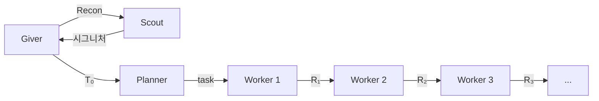

# Giver

v3.6

> *"기억을 전달받는다면, 그건 온전한 기억이어야 한다."*
> — 로이스 로리, 《기억 전달자》
>
> 《기억 전달자》에서 한 사람이 세상의 모든 기억을 품는다. 나머지는 **Sameness** 속에 산다 — 역사도, 맥락도, 축적된 노이즈도 없이. 기억 전달자는 필요한 순간에 필요한 기억만 골라 전달한다. **고통의 전달**(giving of pain)을 통해 레거시의 고통스러운 진실 — 실패, 제약, 절대 피해야 할 것 — 을 정제하여 백지 상태의 수령자에게 주입한다.
>
> 우리의 Giver도 똑같이 작동한다:
>
> | 소설 | 아키텍처 |
> |---|---|
> | 기억 전달자가 모든 기억을 보유 | Giver가 모든 대화 컨텍스트를 보유 |
> | 수령자는 전달받은 것만 받음 | Planner는 Giver의 T₀만 수신 |
> | 공동체는 Sameness 속에 산다 | Worker/Scout는 완전히 fresh — 역사 0 |
> | 전달은 선택적이고 의도적 | Giver는 T₀에 명시적 6섹션만 전달 |
> | 기억은 전달자에만 머물고 아래로 새지 않음 | 대화 컨텍스트는 Giver에만, 하류로 격리 |
> | 고통의 전달 (giving of pain) | Giver가 실패 기억을 Past failures로 주입 |

## Giver란

사용자의 코딩 작업을 대화로 받아, 여러 에이전트에 작업을 나누어 위임하는 오케스트레이터다. 사용자는 Giver와 대화하고, Giver는 체인을 통해 Planner·Scout·Worker를 호출한다.

## 문제: 코딩 I/O의 누적

코딩 에이전트는 파일을 읽고, 코드를 작성하고, 테스트를 돌린다. 이 **코딩 I/O**(소스 파일, 테스트 출력, 에러 로그)가 스텝마다 누적되면 컨텍스트가 지수적으로 증가한다.

$$
|\text{context}(n)| = |\text{context}(1)| \cdot r^{n-1} \quad (r > 1)
$$

컨텍스트가 커지면 **스티어링**(방향 지시: "어떤 파일을 만들지, 어떤 에러를 고칠지")이 코딩 I/O 노이즈에 묻힌다. 결과적으로 에이전트가 엉뚱한 파일을 수정하거나 이미 고친 에러를 재시도하는 등 방향을 잃는다.

## 해법: 스티어링 격리 파이프라인

컨텍스트를 **스티어링**(방향 지시)과 **코딩 I/O**(실행 산출물)로 분해하고, 에이전트 경계에서 스티어링만 전달한다.


Giver는 항상 P→W×10 체인을 시작한다. Planner가 task 수(N ≤ 10)를 결정하면, task 파일이 없는 Worker 슬롯은 no-op로 즉시 종료된다. 같은 파일을 여러 Worker가 순차 수정 가능.

| 경계 | 전달 (스티어링) | 격리 (코딩 I/O) | 격리율 |
|------|--------------|---------------|--------|
| G → P | T₀ | Giver 대화 (~500K토큰) | **99%** |
| P → Wₖ | taskₖ.md | 다른 Worker 태스크 | **83~93%** |
| Wₖ → G | RESULT | Worker 실행 전체 | **98~99%** |

> 격리율 = 1 − (전달 크기 / 격리 전 컨텍스트 크기). 출처: c2e86d3b 체인 측정

## 설계 원칙

[GGON(꼰)](https://gist.github.com/sng2c/a6d201dff2d66b1a589658056e5861a9)을 기반으로 Giver에 맞게 번역했다.

Giver는 T₀를 쓰기 전에 이 원칙들을 적용한다. 작업의 범위, 분할, 위임을 결정한다.

1. **최소 침투**: 기존 구조 보존, 최소 변경으로 요구사항 충족. 핵심 로직 수정보다 새 인터페이스나 브릿지 패턴으로 확장.

2. **중앙 제어 존중**: Giver→Planner→Worker 파이프라인이 중앙 제어. Worker는 구현만, 아키텍처 결정은 Giver와 Planner.

3. **인지 부하 관리**: Human이 인계받을 수 있도록 변경을 명확한 단위로 분할. T₀와 Tₖ는 대화 기록 없이 자체 완결.

4. **관심사 격리**: Worker는 Tₖ 내 파일만 수정. Signatures 참조 파일은 읽기 허용, 수정은 금지.

5. **리팩터 가치 = 다음 변경 비용 감소**: 리팩터링은 자동이 아닌 설계 결정. Giver가 사용자에게 제안, 구체적 메커니즘으로 정당화, 승인 시만 T₀에 포함.

## 3-tier 구조

**Giver**(대화): 사용자 대화에서 결정을 추출하여 T₀를 작성. 코드를 직접 다루지 않음.

**Planner**(계획): T₀에서 Worker별 task{k}.md를 생성. T₀ Signatures가 충분하지 않으면 Target Files에서 구현 패턴을 추출.

**Worker**(실행): 자기 task{k}.md와 이전 Worker의 RESULT만 수신. 격리된 스코프에서 작업을 실행. 각 Worker는 fresh 컨텍스트로 실행되어 부모나 다른 Worker의 I/O에 영향을 받지 않음.

## 파이프라인

```
G → S(Recon) → G → T₀ → P → {T₁, T₂, T₃}
                                ↓
                           W₁(T₁) → R₁
                           W₂(T₂, R₁) → R₂       ← R₂는 R₁을 반영 (조합 전이)
                           W₃(T₃, R₂) → R₃       ← R₃는 R₁, R₂를 반영
```

- **Scout**: Giver가 코드 구조를 직접 읽지 않고 Scout에게 위임. 체인 밖에서만 호출.
- **RESULT = Files + Signatures + Breaking + Summary**: 코드 본문은 포함하지 않아 {previous}를 통한 I/O 역류를 차단.
- **조합 전이**: Rₖ는 Rₖ₋₁의 결과를 반영하여 만들어지므로 정보가 조합적으로 하류에 전달됨. 하지만 각 RESULT는 스티어링만 포함하므로 |Rₖ|는 일정 범위에 바운드됨.

> Phase 정의, SCOPE 규칙, 템플릿, 실패 프로토콜은 [SKILL.md](.pi/agent/skills/giver/SKILL.md) 참조

## 성능

에이전트 1회 실행당 컨텍스트 크기가 구조 효율성의 핵심 지표다. 과제가 복잡하면 총 토큰도 커지는 건 당연하다. **1회 실행당 컨텍스트**로 비교한다.

### 모놀리식·v1 → v3.6.2 진화

```
버전            W_ctx평균    W_ctx최대    이상적%    핵심 변화
──────────────────────────────────────────────────────────────────────
모놀리식(fresh) 152K/18턴    누적 증가      0%       실측: Redbis 44테스트
v1              1.9M 토큰    7.6M 토큰     19%       fork 누수 (Giver 베이스라인)
v2              1.4M 토큰     —            20%       fork 제거
v2.5b           103K 토큰    103K 토큰      67%       Do-When, DI
v3.5            113K 토큰    184K 토큰      33%       Planner 읽기 금지
v3.6.1          4.9KB        11.5KB        —          reads:false
v3.6.2          3.6KB         5.7KB        —          auto-inject
```

**모놀리식(fresh) 152K토큰/18턴 → v3.6.2 Worker 900토큰/실행 (격리 파이프라인 효과)**

### 동일 과제 비교 (Redbis 44테스트, 실측)

| 지표 | 모놀리식(fresh) | v3.6.1 | **v3.6.2** |
|------|----------------|--------|------------|
| W_bytes 평균 | 6,191B | 3,559B | **4,228B** |
| W_tokens 합 | 152K | 344K | 1,141K |
| W_tokens 최대 | 152K | 188K | 397K |
| tk/byte | 25× | 32× | **54×** |
| P+W tokens | 152K | 378K | 1,266K |
| 컨텍스트 | 누적(18턴) ❌ | fresh ✅ | **fresh ✅** |
| 부분 재시도 | 불가 ❌ | Worker 단위 ✅ | **Worker 단위 ✅** |

> 모놀리식(fresh) = 단일 Worker 18턴 순수 실행. fork 버전은 208K(부모 컨텍스트 상속).

### v3.6.1 → v3.6.2 (아티팩트 실측)

| 지표 | v3.6.1 (18체인) | v3.6.2 (5체인) | 변화 |
|------|:-----------:|:----------:|:----:|
| W_bytes 평균 | 4.9KB | 3.6KB | −26% |
| W_bytes 최대 | 11.5KB | 5.7KB | −50% |
| W_tokens 평균 | 841K | 228K | **−73%** |
| W_tokens 최대 | 6.0M | 474K | **−92%** |
| tk/byte 비율 | 171× | 63× | −63% |

> 바이트 = 프롬프트 크기, 토큰 = LLM 실제 처리량. tk/byte 비율이 높을수록 Worker가 파일을 많이 읽었다는 뜻.

## 참조

| 파일 | 내용 |
|------|------|
| [SKILL.md](.pi/agent/skills/giver/SKILL.md) | 전체 구현 (Phase, 템플릿, SCOPE, T₀/Tₖ, 실패 프로토콜) |
| [giver-principles.md](giver-principles.md) | 수학적 정의 (6원리, 집합, 함수, 불변량) |
| [analysis-logic.md](docs/analysis-logic.md) | 분석 로직 및 도구 사용법 |
| [history.md](docs/history.md) | v1~v3.6 개선 이력 |

## 버전 히스토리

| 버전 | 날짜 | 변경 |
|------|------|------|
| v3.0 | 2026-05 | 초기 파이프라인 아키텍처 |
| v3.2 | 2026-05 | 체인 내 Scout 제거, Planner가 Imports needed 큐레이팅 |
| v3.3 | 2026-05 | Planner가 task{k}.md 분리 작성 |
| v3.5 | 2026-05 | Planner "T₀에서만 큐레이팅", RESULT = Files/Signatures/Summary |
| v3.5.13 | 2026-05 | Signatures 통합, Breaking forward, T₀ Target Files, Planner Target Files 읽기 허용 |
| v3.6 | 2026-05 | 설계 원칙 (GGON), 리팩토링 설계 결정화, 모순 6건 수정 |
