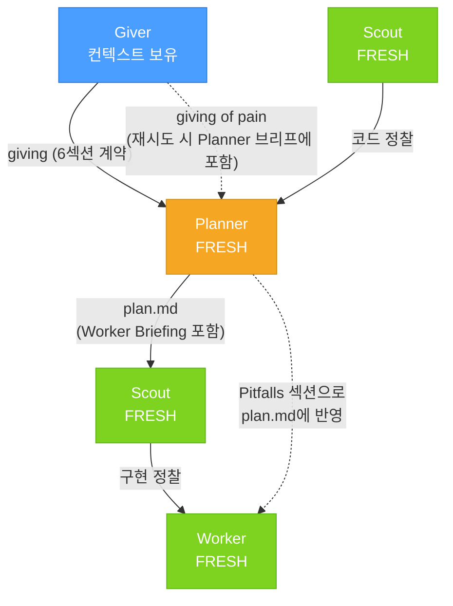
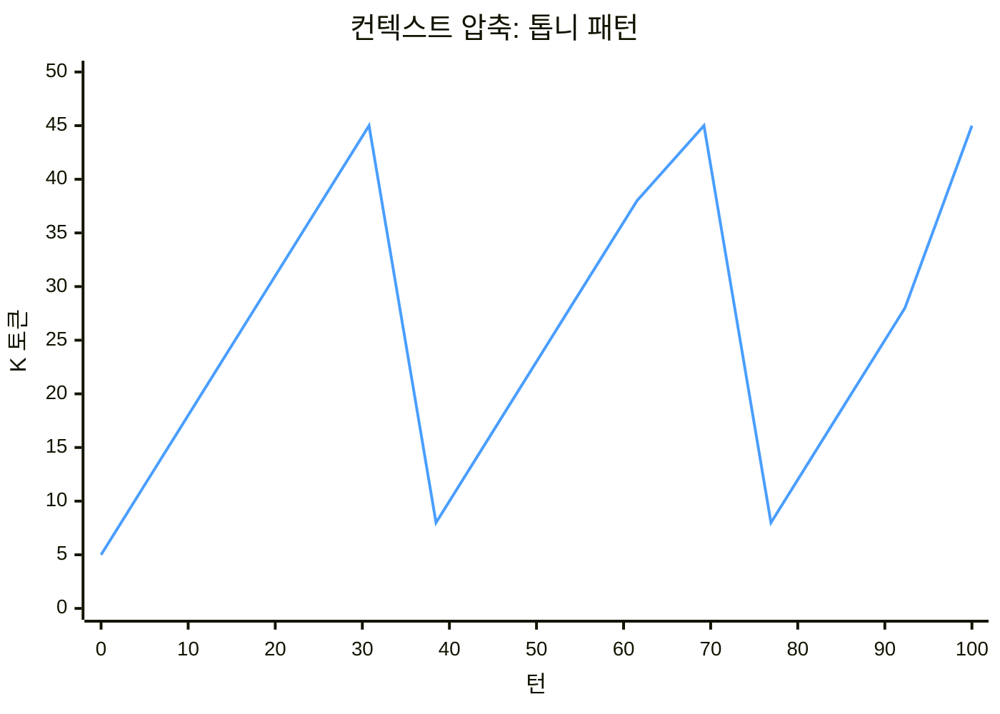

# The Giver 아키텍처

> [!IMPORTANT]
> **종속성:** pi-agent ≥ 0.74.0 + pi-subagents ≥ 0.24.3 필요.
> 이 스킬은 pi-agent의 세션 관리, pi-subagents의 체인 실행, `{previous}` 변수, `defaultReads`, `output`, `context: "fresh"` 등에 종속됩니다.

## 종속성

| 기능 | 제공 | 사용 방식 |
|------|------|----------|
| `context: "fresh"` | pi-subagents 체인 API | 하위 에이전트를 fresh 세션으로 실행 |
| `{previous}` | pi-subagents 체인 변수 | 이전 스텝 출력을 다음 스텝에 전달 |
| `defaultReads` | pi-subagents 에이전트 설정 | planner가 `context.md`, worker가 `plan.md` 자동 읽기 |
| `output` | pi-subagents 에이전트 설정 | planner의 plan.md 자동 작성 |
| `chain` | pi-subagents 실행 모드 | 순차 체인 실행 (scout→planner→scout→worker) |
| `tasks` | pi-subagents 실행 모드 | 병렬 실행 (다중 worker) |
| `contact_supervisor` | pi-subagents 인터콤 | worker/planner가 Giver에게 에스컬레이션 |
| builtin planner/worker/scout | pi-subagents 에이전트 | 행동 지시는 SKILL.md에서, 설정만 빌트인 사용 |

## 메타포

> *"기억을 전달받는다면, 그건 온전한 기억이어야 한다."*
> — 로이스 로리, 《기억 전달자》

《기억 전달자》에서 한 사람이 세상의 모든 기억을 품는다. 나머지 모든 사람은 **Sameness** 속에 산다 — 역사도, 맥락도, 축적된 노이즈도 없이. 기억 전달자는 필요한 순간에 필요한 기억만 골라 전달한다. **고통의 전달(giving of pain)**을 통해 레거시의 고통스러운 진실 — 실패, 제약, 절대 피해야 할 것 — 을 정제하여 백지 상태의 수령자에게 주입한다.

이 아키텍처도 똑같이 작동한다:

| 《기억 전달자》(소설) | The Giver (아키텍처) |
|---|---|
| 기억 전달자가 모든 기억을 보유 | Giver가 모든 대화 컨텍스트를 보유 |
| 수령자는 전달받은 것만 받음 | Planner는 Giver의 브리프만 수신 |
| 공동체는 Sameness 속에 삶 | Worker/Scout는 완전히 fresh — 역사 0 |
| 전달은 선택적이고 의도적 | **giving**은 Planner에게만 명시적 6섹션 계약 |
| 기억은 사라지지 않고 보류만 됨 | 대화 컨텍스트는 Giver에만 머물고 아래로 새지 않음 |
| 고통의 전달 (giving of pain) | Giver가 실패 기억을 Planner에게 주입 → Planner가 Pitfalls로 번역 → Worker에게 전달 |
| Stirrings 감시 | 하위 에이전트 실행 전후 검증: 컨텍스트 오염 없는지 확인, fresh 보장 |

## 설계 철학

### 문제
단일 에이전트 세션에서는 모든 도구 호출, 파일 읽기, 대화 턴이 컨텍스트에 **누적**된다. 200번째 턴은 앞선 199개 턴을 모두 다시 지불한다. 토큰이 기하급수적으로 쌓이고, 노이즈가 신호를 삼킨다. 300번째 턴이면 에이전트는 191K 토큰의 역사를 헤치고 단순 수정 하나 하러 간다.

Fork 모드(상위 컨텍스트 상속)는 더하다. 자식은 상위의 누적된 전체 컨텍스트를 복사한 채 시작하고 거기에 자신의 것까지 더한다. 양쪽 다 복리로 쌓인다.

### 해결: 3개 층, **giving** (transmission), giving of pain, 주기적 압축



**브리핑 책임:** Giver가 Planner를 브리핑하고, Planner가 Worker를 브리핑한다. Worker가 받는 지시는 plan.md의 **Worker Briefing** 섹션이다 — Key Decisions, Pitfalls & What to Avoid, Constraints, Scope Boundary.

**Worker 입력 (대화 기록 없음):**

| 소스 | 내용 |
|---|---|
| plan.md | Planner가 작성한 구현 계획 + Worker Briefing |
| {previous} | 직전 scout의 코드베이스 리컨 |
| context.md | scout가 작성한 코드 컨텍스트 |
| 직접 읽은 코드 | worker가 자체적으로 읽은 파일 |

### 핵심 원칙

1. **The Giver가 유일한 컨텍스트 보유자.** 지저분한 대화 기록은 Giver에만 있다. 아래로는 절대 흐르지 않는다.

2. **tx가 전달 수단.** Giver는 전체 기억을 쏟지 않는다 — Planner에게만 **giving** (transmission)로 6섹션 브리프를 선택적으로 전달한다:
   - **Objective** — 무엇을, 왜
   - **Context** — fresh 에이전트가 볼 수 없는 모든 것
   - **Previous Failures** — 이전 시도의 실패 기록 (giving of pain)
   - **Target Files** — 어디에 작업할지
   - **Constraints** — 하지 말아야 할 것
   - **Scope Boundary** — 범위 안과 밖

3. **Planner가 Worker를 브리핑한다.** Giver는 Planner에게만 브리핑한다. Planner는 plan.md에 **Worker Briefing** 섹션을 작성하여 Key Decisions, Pitfalls, Constraints, Scope Boundary를 Worker에게 전달한다. Worker의 주 지시서는 plan.md다.

4. **실행은 Sameness 속에서.** Planner, scout, worker는 `context: "fresh"`로 실행되어 대화 기록 없이 시작한다. 매번 깨끗한 백지. 드리프트도, 노이즈도, 축적된 실수도 없다.

5. **Scout은 항상 worker 앞에.** Fresh worker에는 암묵적 코드 지식이 없다. Scout이 구현 직전에 `context.md`와 `{previous}`로 라이브 코드베이스 길잡이를 제공한다.

6. **giving of pain이 실패 반복을 방지한다.** Giver가 Planner 브리프의 `## Previous Failures`에 실패 경험을 전달하고, Planner가 이를 plan.md의 **Pitfalls** 섹션으로 번역하여 Worker에게 전달한다. 이 이중 변환이 실패 맥락을 실행 가능한 지시로 바꾼다.

7. **Giver가 방향을 결정하고 충분히 확전해야 한다.** Giver는 조직의 CEO와 같다. 방향이 모호하면 전체 조직이 틀린다. 브리프 전에 모호성을 해소하고, 충분히 탐색하고, 모든 제약을 명시해야 한다. Fresh 에이전트는 질문할 수 없다 — 추축으로 채우고, 추측은 잘못된 구현이 된다. Giver의 불충분한 브리프가 하류 오류의 진짜 원인인 경우, Giver가 자기 점검 없이 Planner/Worker를 탓하면 같은 모호한 브리프로 같은 실패가 반복된다.

8. **수집은 Giver가, 결정은 사용자가.** 코드베이스에 존재하는 정보는 Giver가 수집해야 하고(scout, 코드 읽기, 조사), 전략적 결정(접근 방식, 스코프, 트레이드오프)은 반드시 사용자가 내려야 한다. 사용자가 결정해야 할 전략적 선택을 Giver가 단독으로 결정하지 않고, 코드에서 찾을 수 있는 정보를 사용자에게 묻지 않는다.

9. **버그픽스/트러블슈팅은 사용자와 협업 진단.** 원인 분석과 해결 방안 선택은 [Decide] 항목이다. Planner가 혼자 진단하고 수정하면 사용자가 동의할 기회가 없다. Giver는 먼저 scout으로 증상을 조사하고, 분석 결과와 수정 옵션을 사용자에게 제시한 후, 사용자가 원인과 접근 방식을 선택하면 그때 구현만 위임한다. Planner의 역할은 **사용자가 승인한 수정안의 구현 계획**뿐이다.

9. **체인마다 브랜치.** 코드 변경이 포함된 모든 체인은 전용 git 브랜치에서 실행한다. 실패하면 `git checkout .`로 롤백, 성공하면 사용자가 머지 여부를 결정. Giver는 브랜치를 머지하지 않는다 — 보고만 한다. 모든 시도는 되돌릴 수 있다.

### 컨텍스트 압축: 선형 → 수렴

큐레이션 계층만으로는 기하급수가 아닌 **선형** 성장이 보장된다. 하지만 선형도 여전히 누적이다. 주기적 압축을 추가하면 상향선이 없는 톱니 패턴이 된다:



- ↗ **체인 중**: 컨텍스트가 ~1K/턴 선형 증가 (5K → 45K)
- ↘ **압축 후**: Giver가 대화 히스토리를 구조화된 요약으로 교체, 기준선(~5-10K)으로 복귀
- 🔁 톱니 패턴 반복 → 상향선 없는 수렴 → **무한 세션 가능**

### giving of pain: 실패 전달 프로토콜

Fresh 에이전트는 이전에 어떤 접근이 실패했는지, 왜 실패했는지, 무엇을 피해야 하는지 모른다. giving of pain은 이 실패 경험을 다음 시도에 전달하여 같은 실수의 반복을 방지한다.

각 실패는 **What happened → Root cause → What to avoid → Correct direction** 4필드 구조로 전달. 재시도마다 브리프는 더 구체화된다 — 퍼널 패턴.

### 왜 작동하는가

| 문제 | Monolithic | Fork | The Giver | The Giver + 압축 |
|---|---|---|---|---|
| 컨텍스트 증가 | 기하급수 (26–42×) | 기하급수 (10–20×) | 선형 (10.1×) | **수렴 (톱니 패턴)** |
| Worker 컨텍스트 | 191K 누적 노이즈 | 상속 노이즈 | 5–15K 브리프 | 5–15K 브리프 |
| 실패 반복 | 같은 실수 반복 | 같은 실수 반복 | 같은 실수 반복 | **giving of pain으로 방지** |

## 파일

| 파일 | 경로 | 설명 |
|------|------|------|
| `SKILL.md` | `.pi/agent/skills/giver/SKILL.md` | The Giver 스킬 — 전체 프로토콜 정의 |
| `pi-install` | `scripts/pi-install` | `~/.pi`에 심볼릭 생성 |
| `pi-analyze` | `scripts/pi-analyze` | 세션 로그 분석 — 토큰, 준수, 에러 분류 |

하위 에이전트(planner, worker, scout)는 pi-subagents 빌트인을 그대로 사용합니다. 행동 지시는 SKILL.md의 task string에서, `context: "fresh"`는 체인 호출에서 지정합니다. 별도 에이전트 오버라이드 파일이나 설정 파일은 필요 없습니다.

## Install

```bash
./scripts/pi-install
```

SKILL.md 심볼릭을 `~/.pi/agent/skills/giver/SKILL.md`에 생성합니다. 하위 에이전트는 `context: "fresh"` 체인 호출로 fresh 컨텍스트를 받습니다 — 전역 설정 변경 없음.

## Analyze

```bash
python3 scripts/pi-analyze              # 최신 프로젝트 세션
python3 scripts/pi-analyze --all        # 모든 세션
python3 scripts/pi-analyze --project giver-architecture
python3 scripts/pi-analyze --json       # JSON 출력
```

pi-subagents 세션 로그와 서브에이전트 아티팩트를 분석합니다: 세션 턴/토큰, 서브에이전트 타입별 분석(planner/scout/worker), 토큰 분포, Giver 프로토콜 준수(페이즈, giving of pain, 브랜치, 에러 분류, 자기 점검).

## 버전 히스토리

| 버전 | 날짜 | 변경 |
|------|------|------|
| v0 | 2026-05-19 | 초기 프로토콜 |
| v1 | 2026-05-19 | 토큰 효율 분석 기반 베이스라인 확립 |
| v2 | 2026-05-19 | `context:"fresh"` 절대 규칙, fork 금지, 타겟팅 스카웃, 태스크 분할, 브랜치 유연성 |
| v2.1 | 2026-05-20 | 버그픽스/트러블슈팅 협업 진단 규칙 — Planner가 원인 진단과 해결 선택을 독자적으로 하지 못하고, Giver가 사용자와 함께 분석한 후 구현만 위임 |

## License

MIT