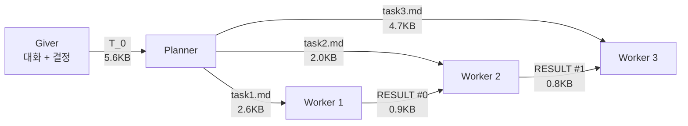
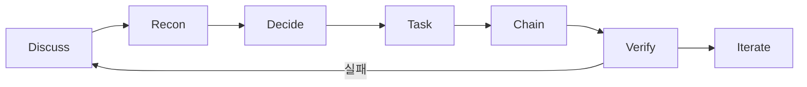
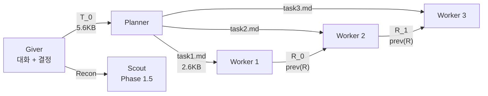

# The Giver v3.5.3

> **필수:** pi-agent ≥ 0.74.0 및 pi-subagents ≥ 0.24.3

## 문제와 해법

### 문제: 코딩 에이전트의 컨텍스트 오염

코딩 에이전트는 파일을 읽고, 코드를 작성하고, 테스트를 돌린다. 이 **코딩 I/O** — 소스 파일 수십 개, 테스트 출력 수백 줄, 에러 로그, 디버그 트레이스 — 가 컨텍스트를 오염시킨다.

Monolithic 에이전트에서는 이 코딩 I/O가 복리로 누적된다. 스텝 1에서 86KB, 스텝 2에서 172KB, 스텝 N에서 864KB. 스티어링(방향 조종: "어떤 파일을 만들지", "어떤 에러 메시지를 쓸지")이 코딩 I/O 오염에 묻혀 에이전트가 방향을 잃는다.

| 스텝 | Monolithic 컨텍스트 | 스티어링 상태 |
|------|---------------------|-------------|
| 1 | 86KB | 오염 시작 |
| 2 | 172KB (2x) | 스티어링이 노이즈에 묻힘 |
| N | 864KB (10x) | 스티어링 거의 식별 불가 |

### 해법: 3-tier 파이프라인으로 격리

Giver v3.5는 3-tier 파이프라인으로 이 문제를 해결한다. 각 에이전트는 대화 전체에 노출되지 않고, 자기에게 필요한 최소 입력만으로 동작한다.

| 경계 | 대화 전체 노출 시 | 최소 입력 | 격리율 |
|------|-----------------|----------|--------|
| Giver → Planner | 500KB+ | 5.6KB (T_0) | **99%** |
| Planner → Worker | 30KB | 2∼5KB (task{k}.md) | **83∼93%** |
| Worker → Giver | 864KB | 0.8∼1.2KB (R) | **98∼99%** |

Giver도 Worker의 코딩 I/O에 노출되지 않는다. Worker가 864KB를 작성해도, Giver가 받는 건 1∼2KB의 RESULT뿐이다. Giver는 커지지 않는다.

## 성능 비교 (redbis-coding-test, 44 tests)

> 모든 수치는 토큰 사용량(input). 구현 디테일은 [SKILL.md](.pi/agent/skills/giver/SKILL.md), 수학적 정의는 [giver-principles.md](giver-principles.md) 참조.

| 버전 | Planner | Worker 1 | Worker 2 | Worker 3 | **Total** | 구조 |
|------|---------|----------|----------|----------|-----------|------|
| monolithic | — | — | — | — | **864K** | Worker 단독 |
| v2.5 best | — | — | — | — | **77K** | P→S→W |
| v3.0 | 15K | 15K | 48K | — | **78K** | P→S→W |
| v3.2 | 23K | 301K | 61K | 30K | **415K** | P→W→W→W |
| v3.3 | 43K | 79K | 71K | 127K | **330K** | P→W→W→W |
| v3.4 | 492K | 62K | 42K | 86K | **693K** | P→W→W→W |
| **v3.5** | **30K** | **68K** | **88K** | **188K** | **378K** | P→W→W→W |

v3.5 핵심 개선:
- **Planner: 492K → 30K (94% 감소)** — "read NO files" SCOPE 룰
- **Worker별 task 파일 분리** — Worker 1이 전체 플랜을 안 읽음
- **체인 내 Scout 제거** — P→W→W→W (Scout은 Recon만)

### 컨텍스트 격리: 코딩 I/O 오염에서 스티어링 보호

각 에이전트는 **스티어링만 수신**하고, **다른 에이전트의 코딩 I/O는 격리**한다. 이 격리 덕분에 Giver 대화가 길어져도(compact 발동), 하류 에이전트의 컨텍스트는 영향을 덜 받는다.

| 에이전트 | 수신 (스티어링) | 격리 (코딩 I/O, 안 읽음) | 오염 방지 |
|----------|----------------|--------------------------|-----------|
| Planner | T_0 (5.6KB) | Giver 대화, 소스 파일, Scout 리콘 원본 | 492K → 30K (94%↓) |
| Worker 1 | task1.md (2.6KB) | task2.md, task3.md, 다른 Worker의 코드/테스트 | 301K → 68K (77%↓) |
| Worker 2 | task2.md + prev(R) (4KB) | task1.md, task3.md, Worker 1의 소스 파일 | 71K → 88K |
| Worker 3 | task3.md + prev(R) (6KB) | task1.md, task2.md, Worker 1,2의 소스 파일 | 127K → 188K |

핵심 원칙: **각 에이전트는 스티어링만 수신하고, 코딩 I/O 오염은 격리한다.** 이 격리 구조 덕분에 compact가 발동해도 하류 컨텍스트는 영향을 덜 받는다.

## 7 Phase 워크플로우

| Phase | 역할 | 행동 |
|-------|------|------|
| **Discuss** | 불명확 → 질문, 버그 → Scout 진단 | 사용자와 대화, 모호함 해소 |
| **Recon** | 코드 구조/시그니처 수집 | Giver가 파일을 직접 읽지 않고 Scout에게 위임 |
| **Decide** | 전략 결정, 대화 압축 | T_0에 넣을 결정사항만 추출 |
| **Task** | T_0 작성 | 5섹션 자연어 헤더로 문서화 |
| **Chain** | P→W→W→... 호출 | 파일 그룹핑, 배치 분할 |
| **Verify** | 테스트/검증, 결과 보고 | 실패 시 분류 |
| **Iterate** | 다음 단계 논의 | 필요시 재체인 |

## 파이프라인 아키텍처

핵심 원칙:
- **Planner는 파일을 읽지 않음** — T_0에 모든 정보가 있음
- **Worker는 자기 task{k}.md만 읽음** — 다른 Worker의 태스크를 볼 필요 없음
- **prev(R)은 이전 단계의 출력만** — 누적이 아님
- **Worker의 R은 Files/Signatures/Summary만** — 코드 본문 포함 안 함
- **Scout은 체인 밖** — Phase 1.5 Recon에서만 호출

> 구현 디테일(Scope 규칙, H 문서 형식, 템플릿, 실패 프로토콜)은 [SKILL.md](.pi/agent/skills/giver/SKILL.md) 참조. 수학적 정의(기호, 연산자, 불변량)는 [giver-principles.md](giver-principles.md) 참조.

## 참조

| 파일 | 내용 |
|------|------|
| `.pi/agent/skills/giver/SKILL.md` | 전체 구현 (Phase, 템플릿, SCOPE, H 문서, 실패 프로토콜) |
| `giver-principles.md` | 수학적 정의 (기호, 연산자, 데이터 구조, 불변량) |

## 버전 히스토리

| 버전 | 날짜 | 변경 |
|------|------|------|
| v3.0 | 2025-05 | 초기 파이프라인 아키텍처 |
| v3.1 | 2025-05 | Phase 1.5 Recon 필수, H 문서 형식, Do-When 패턴 |
| v3.2 | 2025-05 | 체인 내 Scout 제거, Planner가 Imports needed 큐레이팅, SCOPE 규칙 |
| v3.3 | 2025-05 | Planner가 task1.md, task2.md 분리 작성, Worker는 자기 태스크만 읽음 |
| v3.4 | 2025-05 | Worker {previous} 중복 제거, RESULT 형식 간소화 |
| v3.5 | 2025-05 | Planner "read NO files" SCOPE, Planner/Worker 프로젝트 루트 제한 |
| v3.5.1 | 2025-05 | 한국어→영어 통일, File Relationships 추가, Scout fallback, Task #0 용어 통일, 7+ 템플릿 보완 |
| v3.5.2 | 2025-05 | RESULT 포맷: Files/Signatures/Summary (코드 본문 제외) |
| v3.5.3 | 2025-05 | {previous} 이전 단계만 전달 (누적 아님), Giver가 progress.md로 전체 결과 확인 |

## 파일

| 파일 | 설명 |
|------|------|
| `.pi/agent/skills/giver/SKILL.md` | v3.5.3 Giver 스킬 정의 (전체 구현) |
| `giver-principles.md` | v3.5.3 수학적 정의 (기호, 연산자, 불변량) |
| `docs/history.md` | v1~v2.5i 개선 이력 |
| `docs/v25b-skill.md` | v2.5b SKILL 백업 |
| `docs/v3-skill.md` | v3.0 SKILL 백업 |
| `docs/analysis-logic.md` | 분석 로직 레퍼런스 |

