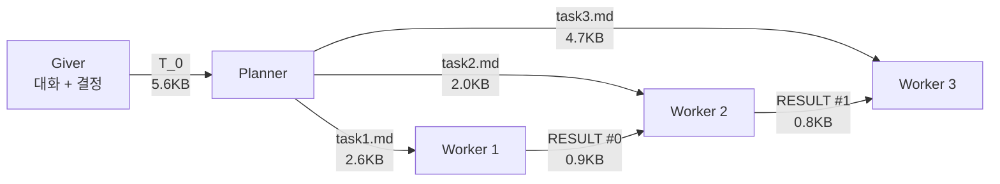
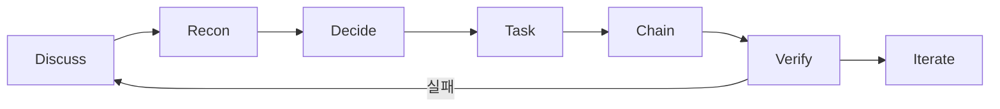
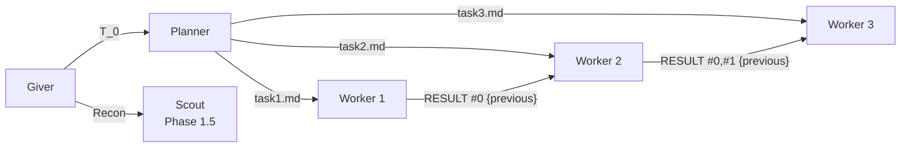

# The Giver v3.5

> **필수:** pi-agent ≥ 0.74.0 및 pi-subagents ≥ 0.24.3

## 문제와 해법

### 문제: 코딩 에이전트의 컨텍스트 오염

코딩 에이전트는 파일을 읽고, 코드를 작성하고, 테스트를 돌린다. 이 **코딩 I/O** — 소스 파일 수십 개, 테스트 출력 수백 줄, 에러 로그, 디버그 트레이스 — 가 컨텍스트를 오염시킨다.

Monolithic 에이전트에서는 이 코딩 I/O가 복리로 누적된다. 스텝 1에서 86KB, 스텝 2에서 172KB, 스텝 N에서 864KB. 스티어링(방향 조종: "어떤 파일을 만들지", "어떤 에러 메시지를 쓸지")이 코딩 I/O 오염에 묻혀 에이전트가 방향을 잃는다.

| 스텝 | Monolithic 컨텍스트 | 스티어링 상태 |
|------|---------------------|-------------|
| 1 | 86KB | 오염 시작 |
| 2 | 172KB (2x) | 스티어링이 노이즈에 묻힘 |
| N | 864KB (10x) | 스티어링 거의 식별 불가 |

### 해법: 3-tier 파이프라인으로 격리

Giver v3.5는 3-tier 파이프라인으로 이 문제를 해결한다. 각 에이전트는 대화 전체에 노출되지 않고, 자기에게 필요한 최소 입력만으로 동작한다.



| 경계 | 대화 전체 노출 시 | 최소 입력 | 격리율 |
|------|-----------------|----------|--------|
| Giver → Planner | 500KB+ | 5.6KB (T_0) | **99%** |
| Planner → Worker | 30KB | 2∼5KB (task{k}.md) | **83∼93%** |
| Worker → Giver | 864KB | 0.8∼1.2KB (RESULT) | **98∼99%** |

Giver도 Worker의 코딩 I/O에 노출되지 않는다. Worker가 864KB를 작성해도, Giver가 받는 건 1∼2KB의 RESULT뿐이다. Giver는 커지지 않는다.

## 성능 비교 (redbis-coding-test, 44 tests)

| 버전 | Planner | Worker 1 | Worker 2 | Worker 3 | **Total** | 구조 |
|------|---------|----------|----------|----------|-----------|------|
| monolithic | — | — | — | — | **864K** | Worker 단독 |
| v2.5 best | — | — | — | — | **77K** | P→S→W |
| v3.0 | 15K | 15K | 48K | — | **78K** | P→S→W |
| v3.2 | 23K | 301K | 61K | 30K | **415K** | P→W→W→W |
| v3.3 | 43K | 79K | 71K | 127K | **330K** | P→W→W→W |
| v3.4 | 492K | 62K | 42K | 86K | **693K** | P→W→W→W |
| **v3.5** | **30K** | **68K** | **88K** | **188K** | **378K** | P→W→W→W |

v3.5 핵심 개선:
- **Planner: 492K → 30K (94% 감소)** — "read NO files" SCOPE 룰
- **Worker별 task 파일 분리** — Worker 1이 전체 플랜을 안 읽음
- **체인 내 Scout 제거** — P→W→W→W (Scout은 Recon만)

### 컨텍스트 격리: 코딩 I/O 오염에서 스티어링 보호

각 에이전트는 **스티어링만 수신**하고, **다른 에이전트의 코딩 I/O는 격리**한다. 이 격리 덕분에 Giver 대화가 길어져도(compact 발동), 하류 에이전트의 컨텍스트는 영향을 덜 받는다.

| 에이전트 | 수신 (스티어링) | 격리 (코딩 I/O, 안 읽음) | 오염 방지 |
|----------|----------------|--------------------------|-----------|
| Planner | T_0 (5.6KB) | Giver 대화, 소스 파일, Scout 리콘 원본 | 492K → 30K (94%↓) |
| Worker 1 | task1.md (2.6KB) | task2.md, task3.md, 다른 Worker의 코드/테스트 | 301K → 68K (77%↓) |
| Worker 2 | task2.md + RESULT #0 (4KB) | task1.md, task3.md, Worker 1의 소스 파일 | 71K → 88K |
| Worker 3 | task3.md + RESULT #0,#1 (6KB) | task1.md, task2.md, Worker 1,2의 소스 파일 | 127K → 188K |

핵심 원칙: **각 에이전트는 스티어링만 수신하고, 코딩 I/O 오염은 격리한다.** 이 격리 구조 덕분에 compact가 발동해도 하류 컨텍스트는 영향을 덜 받는다.


## 7 Phase 워크플로우



| Phase | 역할 | 행동 |
|-------|------|------|
| **Discuss** | 불명확 → 질문, 버그 → Scout 진단 | 사용자와 대화, 모호함 해소 |
| **Recon** | 코드 구조/시그니처 수집 | Giver가 파일을 직접 읽지 않고 Scout에게 위임 |
| **Decide** | 전략 결정, 대화 압축 | T_0에 넣을 결정사항만 추출 |
| **Task** | T_0 작성 | 5섹션 자연어 헤더로 문서화 |
| **Chain** | P→W→W→... 호출 | 파일 그룹핑, 배치 분할 |
| **Verify** | 테스트/검증, 결과 보고 | 실패 시 분류 |
| **Iterate** | 다음 단계 논의 | 필요시 재체인 |

## 파이프라인 아키텍처



핵심 원칙:
- **Planner는 파일을 읽지 않음** — T_0에 모든 정보가 있음
- **Worker는 자기 task{k}.md만 읽음** — 다른 Worker의 태스크를 볼 필요 없음
- **{previous}는 이전 Worker의 RESULT만 전달** — 전체 플랜이 아닌 결과만 누적
- **Scout은 체인 밖** — Phase 1.5 Recon에서만 호출, 체인 내에 Scout 없음

## 데이터 구조

### T_0 — Giver가 작성

```markdown
### Goal
한 문장 목표

### Background
결정사항만 (대화 전체가 아님)

### Past failures
첫 시도면 "None — first attempt", 재시도면 구조화된 실패 로그

### Constraints
기술적 제약, 테스트 기대값 (에러 메시지, 엣지케이스)

### Imports needed
의존성 시그니처 + 파일경로 (Scout에서 수집)
```

### Worker Task (task{k}.md) — Planner가 큐레이팅

```markdown
### Goal
이 Worker에 맞게 큐레이팅된 목표

### Background
이 Worker에 관련된 결정사항만

### Past failures
이 Worker 범위의 실패만

### Constraints
이 Worker에 해당하는 제약만 (테스트 기대값 포함)

### Target Files
타겟 파일 (최대 3개)

### Imports needed
이 Worker가 임포트하는 것만
```

### Worker RESULT — {previous}로 누적 전달

```markdown
----
# RESULT #0 (by Worker 1)

All tests pass.
## Files created
- src/foo.ts

## Files modified
- (none)

## Imports needed (new signatures)
export function fName(params): RetType — path/to/file.ts
```

## 핵심 원칙

1. **Giver는 대화 주체** — 사용자와 대화하고 결정, T_0를 작성
2. **T_0만 하류로 전달** — 대화 전체가 아닌 결정사항만
3. **모든 서브에이전트는 fresh** — `context: fresh` 필수, 예외 없음
4. **Planner는 파일을 읽지 않음** — T_0에 모든 정보 포함, Planner는 큐레이팅만
5. **Planner가 Worker Task를 분리 작성** — task1.md, task2.md, ... 각 Worker는 자기 파일만 읽음
6. **Planner가 효율적으로 큐레이팅** — Constraints에 충분한 컨텍스트를 포함하여 Worker가 추가 파일을 읽지 않도록
7. **Target Files는 Worker당 최대 3개**
8. **Imports needed는 Planner가 Worker별로 큐레이팅** — T_0에서 해당 Worker가 임포트하는 것만
9. **D = (시그니처, 파일경로)** — 실제 시그니처 + 파일경로 필수
10. **RESULT.상태=실패이면 즉시 중단** — 실패 시 Giver에게 리턴
11. **Past failures에 실패 이력 누적** — 재시도 시 이전 실패 포함
12. **Giver는 소스 코드 변경 시 항상 체인(W)을 통해** — Giver 자체는 파일 수정 안 함

## 체인 템플릿

### 1-3 files (1 batch)

```json
{
  "chain": [
    { "agent": "planner", "task": "..." },
    { "agent": "worker", "task": "..." }
  ],
  "context": "fresh",
  "cwd": "{project_root}"
}
```

### 4-6 files (2 batches)

```json
{
  "chain": [
    { "agent": "planner", "task": "..." },
    { "agent": "worker", "task": "..." },
    { "agent": "worker", "task": "..." }
  ],
  "context": "fresh",
  "cwd": "{project_root}"
}
```

### 7+ files (3+ batches)

배치 수만큼 Worker 추가. 각 Worker는 자기 task{k}.md만 읽고 {previous}로 이전 RESULT를 받음.

## SCOPE 규칙

| 에이전트 | SCOPE |
|----------|-------|
| **Planner** | 프로젝트 루트 내 파일만 읽음. 단, T_0에 모든 정보가 있으므로 소스/테스트 파일 읽기 불필요 |
| **Worker** | Target Files와 Imports needed에 명시된 파일만 읽음. 테스트 파일은 읽지 않음 — 기대값은 Constraints에 포함 |
| **Scout** | (Recon only) 지정된 디렉토리 내에서만 탐색 |

## 실패 프로토콜

체인 실패 시 Past failures에 추가:

```
- What happened: (구체적: 에러 메시지, 잘못된 동작)
- Root cause: (WHY — T_0가 불충분했는지, P/W가 오해했는지)
- What to avoid: (Do X only when Y 조건)
- Correct direction: (알려진 경우)
- Giver correction: (T_0가 불충분했으면 인정)
```

**모든 실패 후 필수 자기반성:**
- 정확한 위치를 지정했나? → 아니면 Giver 에러
- 모든 제약을 제공했나? → 아니면 Giver 에러
- 엣지케이스를 포함했나? → 아니면 Giver 에러

### 실패 분류

| 원인 | 패턴 | 해결 |
|------|------|------|
| 전략적 (G) | T_0 불충분, 방향 오류 | Giver가 T_0 수정 후 재시도 |
| 전술적 (P) | task 파일 잘못됨 | Giver가 Planner에 corrected context 제공 |
| 운영적 (W) | plan은 맞지만 구현 오류 | Pitfalls 업데이트 후 W 재시도 |

## Dependency Format

모든 의존성 시그니처에 파일경로 포함:

```
✅ getById(id: string): Promise<User | null> — src/services/user-service.ts
✅ IStorage.get(key: string): Promise<string | null> — src/storage/interface.ts
❌ see src/services/user-service.ts
```

시그니처를 모르면 Phase 1.5에서 Scout를 먼저 실행하여 수집.

## H 문서 형식

`----` 구분자. `#` 은 Task/Result에만. `##` 은 PLAN/Imports needed에.

```markdown
----
# Task #0 (for Planner)

### Goal
...

### Background
...

### Past failures
...

### Constraints
...

### Imports needed
...

----
## PLAN (by Planner)
(plan.md: brief overview)

----
# Task #1 (for Worker 1)

...in task1.md...

----
# RESULT #0 (by Worker 1)

All tests pass.
## Files created
- src/foo.ts

## Files modified
- (none)

## Imports needed (new signatures)
export function fName(params): RetType — path/to/file.ts
```

## 버전 히스토리

| 버전 | 날짜 | 변경 |
|------|------|------|
| v3.0 | 2025-05 | 초기 파이프라인 아키텍처 |
| v3.1 | 2025-05 | Phase 1.5 Recon 필수, H 문서 형식, Do-When 패턴 |
| v3.2 | 2025-05 | 체인 내 Scout 제거, Planner가 Imports needed 큐레이팅, SCOPE 규칙 |
| v3.3 | 2025-05 | Planner가 task1.md, task2.md 분리 작성, Worker는 자기 태스크만 읽음 |
| v3.4 | 2025-05 | Worker {previous} 중복 제거, RESULT 형식 간소화 |
| v3.5 | 2025-05 | Planner "read NO files" SCOPE, Planner/Worker/Scout 프로젝트 루트 제한 |

## 파일

| 파일 | 설명 |
|------|------|
| `.pi/agent/skills/giver/SKILL.md` | v3.5 Giver 스킬 정의 |
| `giver-principles.md` | v3.5 대원칙 |
| `docs/` | 이전 버전 백업 |

