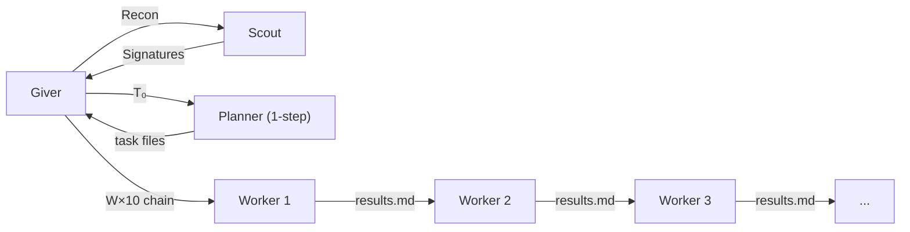

# Giver

v3.7.5

> *"If you're going to receive memories, they should be whole memories."*
> — Lois Lowry, *The Giver*
>
> In *The Giver*, one person holds all of society's memories. Everyone else lives in **Sameness** — no history, no context, no accumulated noise. The Receiver of Memory transmits only what's needed when it's needed. The **giving of pain** — legacy's hard truths, failures, constraints, things never to repeat — is distilled and injected into a blank-slate Receiver.
>
> Our Giver works the same way:
>
> | Novel | Architecture |
> |---|---|
> | Receiver holds all memories | Giver holds all conversation context |
> | Receiver transmits only selected memories | Planner receives only what Giver puts in T₀ |
> | Community lives in Sameness | Workers/Scout run fully fresh — zero history |
> | Transmission is selective and intentional | Giver writes only 6 explicit sections in T₀ |
> | Memories stay with the Receiver, never leak downward | Conversation context stays in Giver, isolated from downstream |
> | Giving of pain | Giver injects failure memories as *Past failures* in T₀ |

## What is Giver?

An orchestrator that receives coding tasks through conversation, then delegates work across multiple agents via chains. The user talks to Giver; Giver calls Planner, Scout, and Worker through a pipeline.

## Problem: Cumulative Coding I/O

Coding agents read files, write code, run tests. This **coding I/O** (source files, test output, error logs) accumulates at each step, causing context to grow exponentially:

$$
|\text{context}(n)| = |\text{context}(1)| \cdot r^{n-1} \quad (r > 1)
$$

As context grows, **steering** (directional instructions: "make this file, fix that error") drowns in coding I/O noise. The agent loses direction — modifying wrong files, retrying already-fixed errors.

## Solution: Steering-Isolated Pipeline

Decompose context into **steering** (directional instructions) and **coding I/O** (execution artifacts). Only steering crosses agent boundaries.



Giver always starts a P→W×10 chain. Planner decides how many tasks to write (N ≤ 10). Workers without a task file output no-op immediately — completionGuard breaks the chain at the first NOOP Worker.

| Boundary | Transmitted (steering) | Isolated (coding I/O) | Isolation rate |
|---|---|---|---|
| G → P | T₀ | Giver conversation (~500K tokens) | **99%** |
| P → Wₖ | taskₖ.md | Other Worker tasks | **83–93%** |
| Wₖ → G | RESULT | Full Worker execution | **98–99%** |

> Isolation rate = 1 − (transmitted size / un-isolated context size). Source: c2e86d3b chain measurement

## Design Principles

Based on [GGON](https://gist.github.com/sng2c/a6d201dff2d66b1a589658056e5861a9), adapted for Giver:

1. **Minimal intrusion**: Preserve existing structure. Satisfy requirements with minimal changes. Extend via new interfaces or bridge patterns rather than modifying core logic.

2. **Respect central control**: The Giver→Planner→Worker pipeline is central control. Workers implement; architectural decisions stay with Giver and Planner.

3. **Manage cognitive load**: Divide changes into clear units so humans can take over. T₀ and Tₖ are self-contained without conversation history.

4. **Separation of concerns**: Workers modify only files listed in their Tₖ. Files referenced in Signatures are read-only.

5. **Refactor value = reduced cost of next change**: Refactoring is a design decision, not automatic. Giver proposes to the user with concrete justification; included in T₀ only when approved.

## 3-Tier Structure

**Giver** (conversation): Extracts decisions from user conversation, writes T₀. Never touches code directly.

**Planner** (planning): Generates per-Worker task{k}.md files from T₀. If T₀ Signatures are insufficient, extracts implementation patterns from Target Files.

**Worker** (execution): Receives only its task{k}.md and previous Workers' RESULTs via results.md. Operates in isolated scope. Each Worker runs with fresh context — unaffected by parent or sibling I/O.

## Pipeline

```
G → S(Recon) → G → T₀ → P → {T₁, T₂, T₃}
                               ↓
                          W₁(T₁) → R₁           ← task file only, NO Planner output
                          W₂(T₂, R₁) → R₂       ← prev Worker RESULT via results.md
                          W₃(T₃, R₂) → R₃       ← combinatorial propagation
```

- **Scout**: Giver delegates code-structure reading to Scout. Called outside the chain only.
- **RESULT = Files + Signatures + Breaking + Summary**: No code bodies — prevents I/O backflow through {previous}.
- **Combinatorial propagation**: Rₖ incorporates Rₖ₋₁, so information propagates combinatorially downstream. But each RESULT contains only steering, so |Rₖ| stays bounded.

## Chain Termination

Workers without a task file output `[CHAIN COMPLETED]` and write nothing. This triggers pi-subagents' **completionGuard** (expected Mutation but no file mutation → exitCode=1), which breaks the chain. Giver reads the completionGuard error message as a success signal and reads results.md from the chain directory for actual Worker results.

## Performance

**in/turn** (input tokens per Worker turn) is the key efficiency metric. Total tokens naturally grow with task complexity, so per-turn efficiency measures structural quality.

### Evolution: Monolithic → v3.7.5

| Version | W tokens avg | W in/turn | Key change |
|---|:---:|:---:|---|
| Monolithic (fresh) | 152K/18 turns | 8K | Baseline: Redbis 44 tests |
| v1 | 1.9M | — | Giver baseline, fork leak |
| v2 | 1.4M | — | Fork removed |
| v2.5b | 103K | — | Do-When, DI |
| v3.5 | 113K | 44K | Planner read ban, W2 64 turns |
| v3.6.1 | 841K | 93K | reads:false (excessive reading) |
| v3.6.2 | 228K | 63K | auto-inject (−32% reading) |
| v3.6.3 | 56K | **12K** | Target Verification (−81% verification) |
| v3.6.7 | — | 12K | W₁ {previous} removed, R8 fix |
| v3.6.8 | — | 17K | brief/echo conflict |
| v3.7.0 | — | 19K | results.md introduced |
| v3.7.5 | — | 19K | [CHAIN COMPLETED] + completionGuard |

**v3.6.3 in/turn (12K) matches monolithic (8K)** — per-Worker efficiency comparable to monolithic, with partial retry capability.

### Same-Task Comparison (Redbis 44 tests, measured)

| Metric | Monolithic (fresh) | v3.6.1 | v3.6.2 | **v3.6.3** |
|---|:---:|:---:|:---:|:---:|
| Active Workers | 1 | 3 | 4 | 5 |
| W tokens total | 152K | 344K | 1,141K | **282K** |
| W tokens avg | 152K | 115K | 285K | **56K** |
| W in/turn | 8K | 93K | 63K | **12K** |
| P+W tokens | 152K | 378K | 1,266K | **421K** |
| Context | cumulative ❌ | fresh ✅ | fresh ✅ | **fresh ✅** |
| Partial retry | impossible ❌ | per-Worker ✅ | per-Worker ✅ | **per-Worker ✅** |

## Installation

```bash
# Via npm
pi install npm:giver-skill

# Via GitHub
pi install git:github.com:sng2c/giver-architecture
```

**Dependency:** pi-subagents ≥ 0.25.0

## References

| File | Content |
|---|---|
| [SKILL.md](skills/giver/SKILL.md) | Full implementation (Phases, templates, SCOPE, T₀/Tₖ, failure protocol) |
| [giver-principles.md](giver-principles.md) | Mathematical definitions (6 principles, sets, functions, invariants) |
| [insights.md](docs/insights.md) | Project insights (15 key insights) |
| [performance-report.md](docs/performance-report.md) | Performance analysis (v1–v3.7.3, in/turn, same-task comparison) |
| [history.md](docs/history.md) | Version history (v1–v3.7.5) |

## Version History

| Version | Date | Change |
|---|---|---|
| v3.0 | 2026-05 | Initial pipeline architecture |
| v3.2 | 2026-05 | Scout removed from chain; Planner curates Imports |
| v3.3 | 2026-05 | Planner writes separate task{k}.md files |
| v3.5 | 2026-05 | Planner "curate from T₀ only", RESULT = Files/Signatures/Summary |
| v3.5.13 | 2026-05 | Signatures integration, Breaking forward, T₀ Target Files |
| v3.6 | 2026-05 | Design principles (GGON), refactoring as design decision |
| v3.6.1 | 2026-05 | reads:false, no-op hardening |
| v3.6.2 | 2026-05 | reads auto-inject, [Write to:] path injection (−63% reading) |
| v3.6.3 | 2026-05 | Target Verification scope (−81% verification effort) |
| v3.6.7 | 2026-05 | {previous} chain echo removed, Breaking template fix |
| v3.6.8 | 2026-05 | "brief" removed, echo/RESULT conflict resolved |
| v3.7.0 | 2026-05 | results.md structural communication, {previous} removed |
| v3.7.3 | 2026-05 | RESULT written to both output and results.md |
| v3.7.5 | 2026-05 | [CHAIN COMPLETED] signal, completionGuard chain break, NOOP Workers save ~5min |

## License

MIT