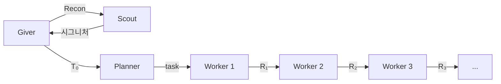

# Giver

v3.6

> *"기억을 전달받는다면, 그건 온전한 기억이어야 한다."*
> — 로이스 로리, 《기억 전달자》
>
> 《기억 전달자》에서 한 사람이 세상의 모든 기억을 품는다. 나머지는 **Sameness** 속에 산다 — 역사도, 맥락도, 축적된 노이즈도 없이. 기억 전달자는 필요한 순간에 필요한 기억만 골라 전달한다. **고통의 전달**(giving of pain)을 통해 레거시의 고통스러운 진실 — 실패, 제약, 절대 피해야 할 것 — 을 정제하여 백지 상태의 수령자에게 주입한다.
>
> 우리의 Giver도 똑같이 작동한다:
>
> | 소설 | 아키텍처 |
> |---|---|
> | 기억 전달자가 모든 기억을 보유 | Giver가 모든 대화 컨텍스트를 보유 |
> | 수령자는 전달받은 것만 받음 | Planner는 Giver의 T₀만 수신 |
> | 공동체는 Sameness 속에 삶 | Worker/Scout는 완전히 fresh — 역사 0 |
> | 전달은 선택적이고 의도적 | Giver는 T₀에 명시적 6섹션만 전달 |
> | 기억은 전달자에만 머물고 아래로 새지 않음 | 대화 컨텍스트는 Giver에만, 하류로 격리 |
> | 고통의 전달 (giving of pain) | Giver가 실패 기억을 Past failures로 주입 |

## Giver란

사용자의 코딩 작업을 대화로 받아, 여러 에이전트에 작업을 나누어 위임하는 오케스트레이터다. 사용자는 Giver와 대화하고, Giver는 체인을 통해 Planner·Scout·Worker를 호출한다.

## 문제: 코딩 I/O의 누적

코딩 에이전트는 파일을 읽고, 코드를 작성하고, 테스트를 돌린다. 이 **코딩 I/O**(소스 파일, 테스트 출력, 에러 로그)가 스텝마다 누적되면 컨텍스트가 지수적으로 증가한다.

$$
|\text{context}(n)| = |\text{context}(1)| \cdot r^{n-1} \quad (r > 1)
$$

컨텍스트가 커지면 **스티어링**(방향 지시: "어떤 파일을 만들지, 어떤 에러를 고칠지")이 코딩 I/O 노이즈에 묻힌다. 결과적으로 에이전트가 엉뚱한 파일을 수정하거나 이미 고친 에러를 재시도하는 등 방향을 잃는다.

## 해법: 스티어링 격리 파이프라인

컨텍스트를 **스티어링**(방향 지시)과 **코딩 I/O**(실행 산출물)로 분해하고, 에이전트 경계에서 스티어링만 전달한다.


Giver는 항상 P→W×10 체인을 시작한다. Planner가 task 수(N ≤ 10)를 결정하면, task 파일이 없는 Worker 슬롯은 no-op로 즉시 종료된다. 같은 파일을 여러 Worker가 순차 수정 가능.

| 경계 | 전달 (스티어링) | 격리 (코딩 I/O) | 격리율 |
|------|--------------|---------------|--------|
| G → P | T₀ | Giver 대화 (~500K토큰) | **99%** |
| P → Wₖ | taskₖ.md | 다른 Worker 태스크 | **83~93%** |
| Wₖ → G | RESULT | Worker 실행 전체 | **98~99%** |

> 격리율 = 1 − (전달 크기 / 격리 전 컨텍스트 크기). 출처: c2e86d3b 체인 측정

## Design Principles

Giver applies these principles before writing T₀. They govern how work is scoped, divided, and delegated.

1. **Minimally Invasive Change**: 기존 구조를 보존하고 최소 변경으로 요구사항을 충족한다. 핵심 로직을 수정하기보다 새 인터페이스나 브릿지 패턴으로 확장한다. 크게 뜯어고치면 Worker가 읽어야 할 파일이 늘어나고, 기존 테스트가 깨지고, Breaking이 하류로 전파된다 — 비용이 수익을 압도한다.

2. **Respect Centralized Control**: Giver→Planner→Worker 파이프라인이 곧 중앙 제어 구조다. 비즈니스 로직과 제어 흐름은 각자의 층에 머문다. Worker가 아키텍처를 결정하면 격리가 깨진다 — 한 Worker의 구조 결정이 다른 Worker의 가정과 충돌하여 "edit→fail→re-read" 루프가 시작된다.

3. **Cognitive Load Management**: Human이 Giver 산출물을 이해하고 인계받을 수 있어야 한다. T₀와 Tₖ는 대화 기록을 거슬러 올라가지 않아도 자체 완결적이어야 한다. 5000줄 파일을 10개의 500줄 파일로 쪼개면 한 Worker가 읽는 컨텍스트가 10분의 1이 되지만, Human도 마찬가지다 — 하나의 파일만 보면 된다.

4. **Isolated Concerns**: Worker는 Tₖ 내 파일만 수정한다. Signatures에 참조된 파일은 읽어도 되지만, 수정은 안 된다. 편의상 Tₖ 밖의 파일을 건드리면 다른 Worker가 그 파일의 상태를 잘못 가정하고, 테스트는 비결정적으로 깨진다.

5. **Refactor Value = Future-Cost Reduction**: 리팩토링은 설계 결정이다 — 자동으로 하지 않는다. 동작은 같아도 다음 변경 비용을 구체적으로 낮추면 정당화된다: 호출자 책임 명확화, 중복 제거, 회귀 탐색 범위 축소, 태스크당 컨텍스트 감소, 테스트 가능성 확보. "나중에 편해진다"는 애매한 주장은 안 된다 — 기계와 메커니즘을 명시해야 한다.

## 3-tier 구조

**Giver**(대화): 사용자 대화에서 결정을 추출하여 T₀를 작성. 코드를 직접 다루지 않음.

**Planner**(계획): T₀에서 Worker별 task{k}.md를 생성. 소스/테스트 파일은 읽지 않음 — T₀에 필요한 정보가 모두 들어 있음.

**Worker**(실행): 자기 task{k}.md와 이전 Worker의 RESULT만 수신. 격리된 스코프에서 작업을 실행. 각 Worker는 fresh 컨텍스트로 실행되어 부모나 다른 Worker의 I/O에 영향을 받지 않음.

## 파이프라인

```
G → S(Recon) → G → T₀ → P → {T₁, T₂, T₃}
                                ↓
                           W₁(T₁) → R₁
                           W₂(T₂, R₁) → R₂       ← R₂는 R₁을 반영 (조합 전이)
                           W₃(T₃, R₂) → R₃       ← R₃는 R₁, R₂를 반영
```

- **Scout**: Giver가 코드 구조를 직접 읽지 않고 Scout에게 위임. 체인 밖에서만 호출.
- **RESULT = Files + Signatures + Breaking + Summary**: 코드 본문은 포함하지 않아 {previous}를 통한 I/O 역류를 차단.
- **조합 전이**: Rₖ는 Rₖ₋₁의 결과를 반영하여 만들어지므로 정보가 조합적으로 하류에 전달됨. 하지만 각 RESULT는 스티어링만 포함하므로 |Rₖ|는 일정 범위에 바운드됨.

> Phase 정의, SCOPE 규칙, 템플릿, 실패 프로토콜은 [SKILL.md](.pi/agent/skills/giver/SKILL.md) 참조

## 성능

> redbis-coding-test 프로젝트(44 tests), c2e86d3b 체인. 토큰 사용량(input).

| 구조 | Planner | Worker 1 | Worker 2 | Worker 3 | **Total** |
|------|---------|----------|----------|----------|-----------|
| Monolithic | — | — | — | — | **864K** |
| v3.5 | 30K | 68K | 86K | 184K | **368K** |

- Monolithic: 단일 에이전트가 전체 작업을 실행. 비교 기준.
- v3.5: 스티어링 격리 파이프라인으로 동일 작업 실행. Total 58% 감소.

## 참조

| 파일 | 내용 |
|------|------|
| [SKILL.md](.pi/agent/skills/giver/SKILL.md) | 전체 구현 (Phase, 템플릿, SCOPE, H 문서, 실패 프로토콜) |
| [giver-principles.md](giver-principles.md) | 수학적 정의 (6원리, 집합, 함수, 불변량) |
| [analysis-logic.md](docs/analysis-logic.md) | 분석 로직 및 도구 사용법 |
| [history.md](docs/history.md) | v1~v2.5i 개선 이력 |

## 버전 히스토리

| 버전 | 날짜 | 변경 |
|------|------|------|
| v3.0 | 2025-05 | 초기 파이프라인 아키텍처 |
| v3.2 | 2025-05 | 체인 내 Scout 제거, Planner가 Imports needed 큐레이팅 |
| v3.3 | 2025-05 | Planner가 task{k}.md 분리 작성 |
| v3.5 | 2025-05 | Planner "T₀에서만 큐레이팅", RESULT = Files/Signatures/Summary |
| v3.5.13 | 2025-05 | Signatures 통합, Breaking forward, T₀ Target Files, Planner Target Files 읽기 허용 |
| v3.6 | 2025-05 | Design Principles (GGON), 리팩토링 설계 결정화, 모순 6건 수정 |