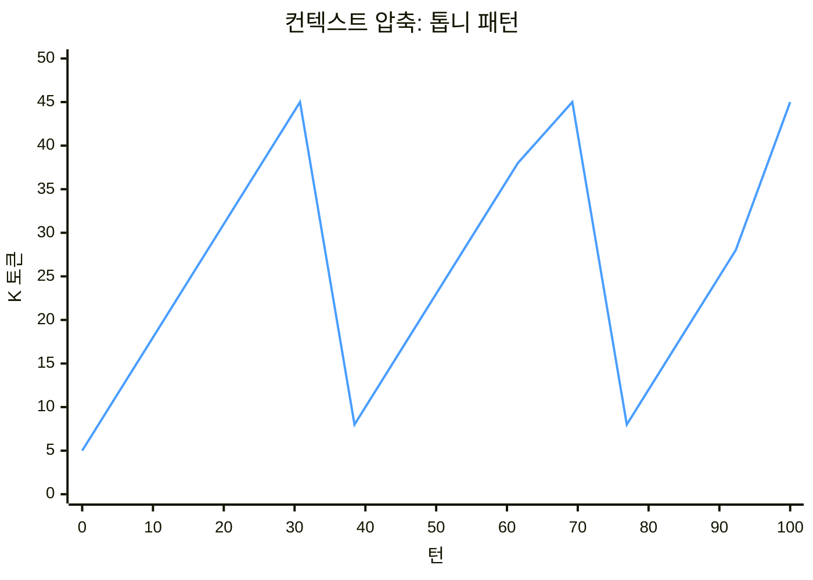

# The Giver 아키텍처

> [!IMPORTANT]
> **시스템 요구사항:** pi-agent ≥ 0.74.0 및 pi-subagents ≥ 0.24.3 버전이 필요합니다.
> 이 스킬은 pi-agent의 세션 관리와 pi-subagents의 체인 실행 기능, 그리고 `{previous}` 변수, `defaultReads`, `output`, `context: "fresh"` 등의 핵심 옵션들에 의존하여 동작합니다.

## 종속성

| 기능 | 제공 | 활용 방식 |
|------|------|----------|
| `context: "fresh"` | pi-subagents 체인 API | 하위 에이전트를 이전 맥락이 없는 초기화된 세션으로 실행 |
| `{previous}` | pi-subagents 체인 변수 | 이전 단계의 출력값을 다음 단계의 입력으로 전달 |
| `defaultReads` | pi-subagents 에이전트 설정 | planner는 `context.md`, worker는 `plan.md`를 자동 인식 |
| `output` | pi-subagents 에이전트 설정 | planner가 작성한 결과를 `plan.md`로 자동 저장 |
| `chain` | pi-subagents 실행 모드 | 순차 체인 실행 (scout → planner → scout → worker) |
| `tasks` | pi-subagents 실행 모드 | 병렬 실행 (다중 worker 환경) |
| `contact_supervisor` | pi-subagents 인터콤 | worker/planner가 문제 발생 시 Giver에게 상황 에스컬레이션 |
| builtin planner/scout/worker | pi-subagents 에이전트 | 내장 에이전트를 사용하되, 구체적 행동 지시는 SKILL.md에서 제어 |

## 메타포: 기억의 선택적 전달

> *"기억을 전달받는다면, 그건 온전한 기억이어야 한다."*
>
> — 로이스 로리, 《기억 전달자》

소설 《기억 전달자(The Giver)》에서는 단 한 사람이 세상의 모든 기억을 짊어집니다. 나머지 사람들은 역사나 맥락, 축적된 노이즈 없이 철저히 통제된 '늘 같음(Sameness)' 속에서 살아갑니다. 기억 전달자는 꼭 필요한 순간에, 필요한 기억만을 선별해 수령자에게 전달합니다. 특히 **'고통의 전달(giving of pain)'** 과정을 통해 과거의 뼈아픈 진실—실패, 한계, 피해야 할 금기—을 정제하여 백지상태의 수령자에게 안전하게 주입합니다.

이 아키텍처 역시 정확히 같은 철학으로 작동합니다:

| 《기억 전달자》(소설) | The Giver (아키텍처) |
|---|---|
| 기억 전달자가 모든 기억을 통제 | **Giver**가 대화의 모든 컨텍스트를 독점 보유 |
| 수령자는 제한된 정보만 수신 | **Planner**는 Giver가 요약한 핵심 브리프만 수신 |
| 공동체는 통제된 Sameness에 거주 | **Worker/Scout**는 이전 이력이 없는 완전한 'Fresh' 상태로 실행 |
| 철저히 의도적이고 선택적인 전달 | Planner에게 명시된 6가지 섹션의 계약 형태로만 정보 전달(**giving**) |
| 기억은 사라지지 않고 보류됨 | 방대한 대화 기록은 Giver 계층에 머물며 하위로 누수되지 않음 |
| 고통의 전달 (giving of pain) | Giver가 실패 이력을 Planner에게 전달 → Planner가 이를 **Pitfalls**(회피 대상)로 번역하여 Worker에게 주입 |
| 'Stirrings' 발생 감시 및 억제 | 하위 에이전트 실행 전후로 컨텍스트 오염 여부를 검증하여 Fresh 상태 보장 |

## 설계 철학

### 직면한 문제: 토큰의 복리 효과

일반적인 LLM 에이전트는 대화 턴이 넘어갈 때마다 이전의 모든 기록을 다시 입력값으로 처리합니다. 여기서부터 아키텍처를 무너뜨리는 '복리 효과'가 시작됩니다.

1. **무한한 누적 입력:** 도구 호출, 파일 읽기 결과, 대화 내용이 컨텍스트에 계속 쌓입니다. 200번째 턴에 도달한 에이전트는 앞선 199번의 기록을 모두 다시 읽어야 합니다. 단순한 버그 하나를 고치기 위해 191K 토큰 분량의 과거 역사를 헤집어야 하는 비효율이 발생합니다.

2. **지시 방향의 희석:** 과거 대화의 볼륨이 비대해질수록, 정작 중요한 '현재의 지시 사항'은 그 속에 파묻혀 희석됩니다. 이를 보상하려 지시를 더 길게 적게 되고, 이는 다시 컨텍스트를 비대하게 만드는 악순환을 낳습니다.

3. **병렬 처리(Fork)의 함정:** 자식 프로세스를 분기(Fork)하면 부모의 컨텍스트를 상속받아 즉시 병렬 작업을 시작할 수 있어 속도 면에서는 유리합니다. 하지만 상속받은 방대한 볼륨 전체를 매 턴 재처리해야 하므로, 부모의 200K 토큰에 자식의 누적 토큰이 더해져 자원 낭비가 기하급수적으로 배가됩니다. 병렬로 얻은 속도가 배수의 낭비로 상쇄됩니다.

### 해결책: 3-Tier 구조와 토큰 예산 통제

The Giver 아키텍처는 컨텍스트 관리를 3개의 독립된 계층으로 분리하여, 각 층의 역할과 처리할 토큰 예산을 엄격하게 통제합니다.

<table>
<tr><th colspan="2" style="background:#1a2744">🏢 Giver (Context Keeper)</th></tr>
<tr><td colspan="2">
<b>역할:</b> 전체 대화 기록 보유, 전략적 결정, 브리핑 작성 및 실패 경험 전달<br>
<b>토큰 흐름:</b> 선형 증가 → 주기적 압축 → 수렴 (톱니 패턴 유지)<br>
<b>입력 데이터:</b> 사용자 메시지 + 하위 에이전트의 실행 결과<br>
<b>컨텍스트 통제:</b> 전체 기록은 독점하되, 하위 계층으로는 6섹션 브리프(~5-15K)만 엄선하여 전달
</td></tr>
<tr style="background:#2a1a44"><th>📋 Planner (Fresh)</th><th>🔍 Scout (Fresh)</th></tr>
<tr><td>
<b>역할:</b> 구현 계획 수립 및 Worker용 브리핑 작성<br>
<b>토큰 상한:</b> ≤500K<br>
<b>입력 데이터:</b> Giver의 브리프 + Scout의 사전 조사 결과<br>
<b>특징:</b> 이전 대화 기록이 전혀 없는 초기화 상태
</td><td>
<b>역할:</b> 코드 정찰 및 타겟팅된 정보 수집<br>
<b>토큰 상한:</b> ≤100K (타겟팅 적용 시)<br>
<b>입력 데이터:</b> 조사 대상에 대한 타겟팅 지시만 수신<br>
<b>특징:</b> 이전 대화 기록이 전혀 없는 초기화 상태
</td></tr>
<tr><th colspan="2" style="background:#1a3322">⚙️ Worker (Fresh)</th></tr>
<tr><td colspan="2">
<b>역할:</b> 실제 코드 변경 및 구현 실행<br>
<b>토큰 상한:</b> ≤80K (이상적 수준) — 브리프, 조사 결과, 대상 코드만 포함<br>
<b>입력 데이터:</b> <code>plan.md</code> + <code>{previous}</code> + 대상 파일<br>
<b>특징:</b> 대화 기록 0. 오직 당면한 구현에 필요한 핵심 정보만 가지고 작업
</td></tr>
</table>

## 성능 검증

### 통제 실험: 동일 과제 모놀리식 vs Giver v2.2

동일 인력이 동일 과제(Redis 프록시 10개 모듈, 113개 테스트)를 모놀리식과 Giver v2.3로 각각 구현. **모놀리식 토큰 실측 포함.**

| 항목 | 모놀리식 | Giver v2.3 |
|------|----------|-----------|
| 결과 | ✅ 113/113 테스트 통과 | ✅ 113/113 테스트 통과 |
| 산출물 | 540줄 (10개 파일) | 498줄 (10개 파일) |
| 방식 | 단일 Worker (FORK 상속, 41턴) | 3개 체인 (Fresh 격리) |
| **Input 토큰 (실측)** | **857K 🔴** | **160K 🟢 (정상 체인)** |
| 실패 시 격리 | ❌ 이전 컨텍스트 오염 | ✅ 새 체인으로 재시도 |

**Giver v2.2 체인별 상세:**

| # | 과제 | Planner | Scout | Worker | 합계 | 이상적 |
|---|------|--------:|------:|-------:|-----:|:------:|
| 1 | 4개 기초 모듈 | 85K 🟡 | 19K 🟢 | 55K 🟢 | **160K** | 2/3 |
| 2 | 3개 중간 모듈 | 283K 🟠 | 10K 🟢 | 369K 🟠 | 662K | 1/3 |
| 3 | 2개 서버 모듈 | 301K 🟠 | 21K 🟢 | 82K 🟡 | 404K | 1/3 |

> 모놀리식 Worker 857K 🔴 (fork 상속, 41턴). Giver 정상 체인(1번) 160K → **모놀리식 대비 -81% 절감 (실측)**.
>
> 2번/3번 체인 Planner가 283K/301K로 높은 이유: Planner가 스코프 외 파일까지 읽음. Task Splitting은 체인당 모듈 수에 적용되었으나, 각 Planner가 전체 테스트 코드를 읽음.

**giving of pain 효과 — 점진적 개선:**

| 체인 | 합계 | 모놀리식 대비 | 비고 |
|------|-----:|:------------:|------|
| 모놀리식 (단일 Worker) | **857K** | 기준 | FORK 상속, 41턴 |
| Giver 정상 (1번) | **160K** | **-81%** | ✅ 스코프 좁음 |
| Giver 비정상 (2번) | 662K | -23% | Planner 과도 읽기 |
| Giver 비정상 (3번) | 404K | -53% | Planner 과도 읽기 |

> 상세 리포트: [`reports/redbis-comparison-report.md`](reports/redbis-comparison-report.md)

### 버전별 관측 데이터 (PTT 프로젝트)

| 지표 | v1 | v2 | v2.1 | **v2.2** | v1 대비 |
|------|-----|-----|------|------|---------|
| Fork 호출 | 8건 | 0건 | 0건 | **0건** | ✅ 제거 |
| `context:"fresh"` | 3% | 100% | 100% | **100%** | ✅ 완전 준수 |
| Scout 평균 | 275K | 105K | 133K | **59K** 🟢 | ✅ 78% 절감 |
| Planner 평균 | 691K | 513K | 182K | **61K** 🟢 | ✅ **91% 절감** |
| Worker 평균 | 1.9M | 1.4M | 975K | **245K** | ✅ 87% 절감 |
| Planner 이상적(≤80K) | 0% | 0% | 25% | **100%** | ✅ 완전 달성 |

> 🟢 = 이상적 범위(≤80K) · PTT 프로젝트 관측 데이터 (v1: 52세션, v2: 5체인, v2.1: 7체인, v2.2: 1체인)

### 버전별 달성

**v1 → v2: 격리 복원.** `context:"fresh"` 3% → 100%, fork 8건 → 0건. Worker 버그 수정 8K 🟢 달성.

**v2 → v2.1: 협업 진단.** Phase 0.5 도입. Planner 513K → 182K(-64%). 최초 이상적 달성.

**v2.1 → v2.2: 구조화.** Phase 체크리스트, Scout 3요소 템플릿, 파일 카운트 단계 추가. Planner 61K 🟢, Scout 59K 🟢.

### 개선 항목 이력

| # | 버전 | 항목 | 근거 | 효과 |
|---|------|------|------|------|
| 1 | v2 | 🔴 `context:"fresh"` 모든 호출에 명시 | v1: 97% 미지정 | fork 0건, fresh 100% |
| 2 | v2 | 🔴 `context:"fork"` 금지 | v1: 8건 fork, 최대 7.6M 누수 | fork 0건 |
| 3 | v2 | 🟡 Scout 타겟팅 지시 | v1: Scout 평균 275K | Scout -62% |
| 4 | v2 | 🟡 Target Files에 "Unknown" 금지 | v1: Worker 과도한 코드 리딩 | Worker -25% |
| 5 | v2 | 🟢 3+ 파일 태스크 분할 | v1: 대형 리팩토링 Worker 과다 | 검증 필요 |
| 6 | v2 | 🟢 브랜치 네이밍 프로젝트 컨벤션 존중 | v1: `giver/` 4% (2/52) | N/A |
| 7 | v2 | 🔴 체인당 Worker 1개 | v1: 다중 Worker가 Giver 평가 우회 | 1 Worker/chain 달성 |
| 8 | v2.1 | 🔴 버그픽스 협업 진단(Phase 0.5) | Planner가 진단 독자 결정 | Planner -64% |
| 9 | v2.2 | 🟡 태스크 분할 트리거 확장 | v2.1: 4.9M Worker 분할 미적용 | 검증 필요 |
| 10 | v2.2 | 🟡 Scout output limit 200→150줄 | v2.1: Scout 평균 133K | ✅ Scout 59K (-56%) |
| 11 | v2.2 | 🟢 Phase 1.5 파일 카운트 단계 | 태스크 분할 0% 준수 | 검증 필요 |
| 12 | v2.2 | 🟢 Phase 2/3 체크리스트 | Target Files "Unknown" 방지 | ✅ Target Files 지정 확인 |
| 13 | v2.2 | 🟢 Scout 3요소 템플릿 구조화 | Scout 타겟팅 40% 준수 | ✅ 2/2 Scout 이상적 🟢 |
| 14 | v2.3 | 🔴 Previous Failures 요약 필수 | Planner 3.3M 입력 (전체 출력 복사) | 통제 실험에서 누수 72% 차지 |
| 15 | v2.3 | 🟡 Worker 파일 생성 강조 | Worker가 진행 보고서 작성 대신 파일 생성 | 통제 실험 1차 체인에서 실패 |
| 16 | v2.3 | 🔴 Planner 과도 읽기 금지 | Planner 283K/301K (스코프 외 파일 읽기) | 통제 실험: Planner가 Target Files 외 파일 읽음 |
| 17 | v2.4 | 🟡 연속 체인 자동 실행 | 다중 체인 시 사용자 확인 없이 연속 실행 | 통제 실험: 3체인을 한 번에 실행 |
| 18 | v2.4 | 🔴 재시도 시 사용자 결정 | 체인 실패 시 자동 재시도 금지 | 통제 실험: 2번/3번 체인 과도 읽기 원인 분석 |

> 🔴 = 프로토콜 위반 방지 · 🟡 = 토큰 절감 · 🟢 = 구조화(준수율 향상)

## 핵심 원칙

1. **Giver만이 컨텍스트를 소유한다.** 길고 복잡한 대화의 역사는 오직 Giver 계층에만 존재해야 합니다. 이 노이즈가 하위 계층으로 흘러가게 두어선 안 됩니다.

2. **통제된 양식으로만 전달(giving)한다.** Giver는 Planner에게만 6가지 핵심 섹션(Objective, Context, Previous Failures, Target Files, Constraints, Scope Boundary)으로 구성된 브리프를 엄격하게 전달합니다.

3. **브리핑 책임의 연쇄 작용.** Giver는 Planner를 브리핑하고, Planner는 이를 바탕으로 Worker를 브리핑합니다. Worker의 유일한 행동 지침은 Planner가 작성한 `plan.md` 내의 **Worker Briefing** 섹션뿐입니다.

4. **실행은 철저한 백지상태(Sameness)에서.** Planner, Scout, Worker는 반드시 `context: "fresh"` 옵션으로 실행되어야 합니다. 과거의 방향성 상실(Drift), 누적된 노이즈, 이전의 실수 등 어떠한 오염도 없는 깨끗한 상태에서 시작해야 합니다.

5. **정찰(Scout)이 항상 먼저다.** 초기화된 Worker는 코드베이스에 대한 암묵적인 지식이 없습니다. 반드시 Scout이 앞서 투입되어 코드 길잡이를 마련해야 합니다.

6. **실패를 자산으로 만드는 '고통의 전달(giving of pain)'.** Giver가 실패 요인을 Planner에게 전달하면, Planner는 이를 Pitfalls(절대 피해야 할 것) 지침으로 번역하여 Worker의 지시서에 포함시킵니다.

7. **방향 설정과 확전의 책임은 Giver에게 있다.** Giver는 하위에 지시를 내리기 전, 스스로 모호성을 해소하고 충분히 탐색하여 모든 제약 사항을 명확히 해야 합니다.

8. **수집은 Giver의 몫, 결정은 사용자의 몫.** 코드베이스에 존재하는 팩트는 Giver가 직접 조사해야 하지만, 접근 방식이나 스코프 조정 같은 '전략적 선택'은 반드시 사용자에게 물어 결정해야 합니다.

9. **문제 해결은 사용자와의 협업으로 진행한다.** 에러의 원인을 진단하고 수정 방향을 결정하는 것은 전략적 판단의 영역입니다. Planner가 이를 독단적으로 결정하게 두면 사용자가 개입할 기회가 사라집니다. Giver가 먼저 Scout을 통해 증상을 분석하고 사용자에게 옵션을 제시한 뒤, 사용자가 승인한 해결책만을 Planner에게 구현하도록 위임해야 합니다.

10. **안전망을 위한 브랜치 격리.** 코드가 변경되는 모든 체인은 전용 Git 브랜치에서 실행합니다. 실패하면 롤백하고, 성공했을 때만 사용자가 병합을 결정합니다. Giver는 병합 권한이 없으며 오직 보고만 수행합니다.

## 컨텍스트 압축 메커니즘: 톱니 패턴

단순히 계층을 나누는 것만으로는 누적되는 토큰을 완벽히 막을 수 없습니다. 선형적인 증가세 역시 결국엔 컨텍스트 한계에 부딪히기 때문입니다. 이에 주기적인 압축 프로세스를 도입하여, 컨텍스트 용량이 우상향하지 않고 기준선으로 회귀하는 '톱니 패턴(Sawtooth Pattern)'을 완성했습니다.



- ↗ **체인 진행 중**: 턴당 약 1K씩 컨텍스트가 선형 증가합니다 (5K → 45K).
- ↘ **압축 실행 후**: Giver가 길어진 대화 기록을 구조화된 요약본으로 대체하여 기준선(~5-10K)으로 되돌립니다.
- 🔁 **무한 세션 보장**: 이 패턴이 반복되며 컨텍스트 한계에 도달하지 않고 영구적인 세션 유지가 가능해집니다.

## 파일 및 시스템 구성

| 파일 | 경로 | 설명 |
|------|------|------|
| `SKILL.md` | `.pi/agent/skills/giver/SKILL.md` | The Giver 스킬 핵심 파일 — 전체 프로토콜 정의 |
| `pi-install` | `scripts/pi-install` | `~/.pi` 환경에 심볼릭 링크를 생성하는 설치 스크립트 |
| `pi-analyze` | `scripts/pi-analyze` | 세션 로그 분석 툴 — 토큰 사용량, 규정 준수 여부, 에러 분류 등 측정 |
| `analysis-logic.md` | `docs/analysis-logic.md` | pi-analyze의 감지 패턴 및 메트릭 계산 로직 문서 |
| `baseline-v1-report.md` | `reports/baseline-v1-report.md` | v1 베이스라인 성능 리포트 |
| `v1-vs-v2-report.md` | `reports/v1-vs-v2-report.md` | v1 vs v2 비교 리포트 |
| `v2.1-analysis-report.md` | `reports/v2.1-analysis-report.md` | v2.1 협업 진단 효과 분석 리포트 |
| `v2.2-analysis-report.md` | `reports/v2.2-analysis-report.md` | v2.2 구조화 개선 분석 리포트 |
| `v2.2-remaining-issues.md` | `reports/v2.2-remaining-issues.md` | v2.2 잔존 과제 및 개선 방안 |
| `redbis-comparison-report.md` | `reports/redbis-comparison-report.md` | 모놀리식 vs Giver v2.2 통제 실험 비교 |
| `redbis-comparison-report.md` | `reports/redbis-comparison-report.md` | 모놀리식 vs Giver v2.3 코딩 테스트 비교 (실측) |

하위 에이전트(Planner, Worker, Scout)는 pi-subagents의 기본 내장 에이전트를 그대로 활용합니다. 구체적인 행동 지침은 SKILL.md의 Task string을 통해 부여하며, 체인 호출 시 `context: "fresh"`를 부여해 상태를 제어합니다.

## 설치 및 분석 가이드

**설치하기**

```bash
./scripts/pi-install
```

이 스크립트는 SKILL.md의 심볼릭 링크를 지정된 위치에 생성합니다. 기존의 전역 설정은 변경되지 않습니다.

**성능 분석하기**

```bash
python3 scripts/pi-analyze              # 최신 프로젝트 세션 분석
python3 scripts/pi-analyze --all        # 전체 세션 분석
python3 scripts/pi-analyze --project giver-architecture
python3 scripts/pi-analyze --json       # 결과를 JSON 형태로 출력
```

## 버전 히스토리

| 버전 | 날짜 | 변경 |
|------|------|------|
| v0 | 2026-05-19 | 초기 프로토콜 |
| v1 | 2026-05-19 | 토큰 효율 분석 기반 베이스라인 확립 |
| v2 | 2026-05-19 | `context:"fresh"` 절대 규칙, fork 금지, 타겟팅 스카웃, 태스크 분할, 체인당 Worker 1개, 브랜치 유연성 |
| v2.1 | 2026-05-20 | 버그픽스/트러블슈팅 협업 진단(Phase 0.5) — Planner가 원인 진단과 해결 선택을 독자적으로 하지 못하고, Giver가 사용자와 함께 분석한 후 구현만 위임 |
| v2.2 | 2026-05-20 | 태스크 분할 트리거 확장, Scout output limit 200→150줄, Phase 1.5 파일 카운트, Phase 2/3 체크리스트, Scout 3요소 템플릿 |

## License

MIT