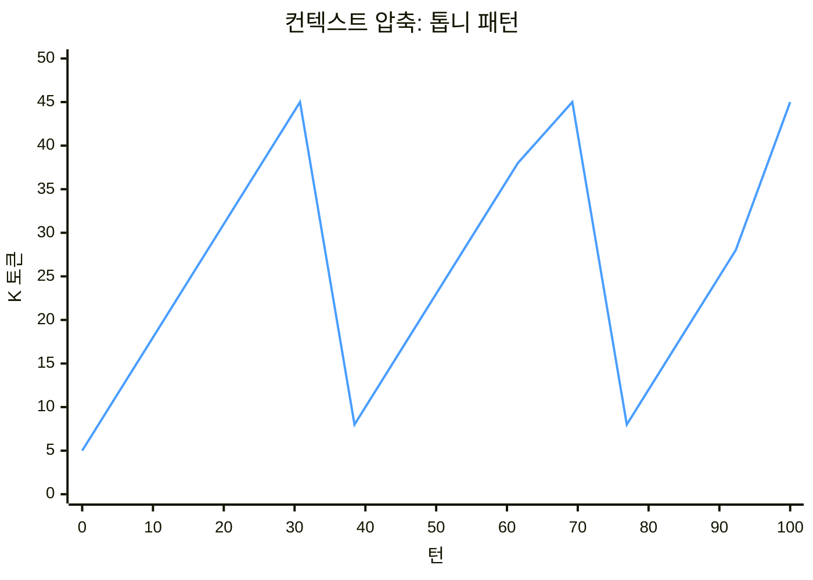

# The Giver 아키텍처

> [!IMPORTANT]
> **시스템 요구사항:** pi-agent ≥ 0.74.0 및 pi-subagents ≥ 0.24.3 버전이 필요합니다.
> 이 스킬은 pi-agent의 세션 관리와 pi-subagents의 체인 실행 기능, 그리고 `{previous}` 변수, `defaultReads`, `output`, `context: "fresh"` 등의 핵심 옵션들에 의존하여 동작합니다.

## 종속성

| 기능 | 제공 | 활용 방식 |
|------|------|----------|
| `context: "fresh"` | pi-subagents 체인 API | 하위 에이전트를 이전 맥락이 없는 초기화된 세션으로 실행 |
| `{previous}` | pi-subagents 체인 변수 | 이전 단계의 출력값을 다음 단계의 입력으로 전달 |
| `defaultReads` | pi-subagents 에이전트 설정 | planner는 `context.md`, worker는 `plan.md`를 자동 인식 |
| `output` | pi-subagents 에이전트 설정 | planner가 작성한 결과를 `plan.md`로 자동 저장 |
| `chain` | pi-subagents 실행 모드 | 순차 체인 실행 (scout → planner → scout → worker) |
| `tasks` | pi-subagents 실행 모드 | 병렬 실행 (다중 worker 환경) |
| `contact_supervisor` | pi-subagents 인터콤 | worker/planner가 문제 발생 시 Giver에게 상황 에스컬레이션 |
| builtin planner/scout/worker | pi-subagents 에이전트 | 내장 에이전트를 사용하되, 구체적 행동 지시는 SKILL.md에서 제어 |

## 메타포: 기억의 선택적 전달

> *"기억을 전달받는다면, 그건 온전한 기억이어야 한다."*
> — 로이스 로리, 《기억 전달자》

소설 《기억 전달자(The Giver)》에서는 단 한 사람이 세상의 모든 기억을 짊어집니다. 나머지 사람들은 역사나 맥락, 축적된 노이즈 없이 철저히 통제된 '늘 같음(Sameness)' 속에서 살아갑니다. 기억 전달자는 꼭 필요한 순간에, 필요한 기억만을 선별해 수령자에게 전달합니다. 특히 **'고통의 전달(giving of pain)'** 과정을 통해 과거의 뼈아픈 진실—실패, 한계, 피해야 할 금기—을 정제하여 백지상태의 수령자에게 안전하게 주입합니다.

이 아키텍처 역시 정확히 같은 철학으로 작동합니다:

| 《기억 전달자》(소설) | The Giver (아키텍처) |
|---|---|
| 기억 전달자가 모든 기억을 통제 | **Giver**가 대화의 모든 컨텍스트를 독점 보유 |
| 수령자는 제한된 정보만 수신 | **Planner**는 Giver가 요약한 핵심 브리프만 수신 |
| 공동체는 통제된 Sameness에 거주 | **Worker/Scout**는 이전 이력이 없는 완전한 'Fresh' 상태로 실행 |
| 철저히 의도적이고 선택적인 전달 | Planner에게 명시된 6가지 섹션의 계약 형태로만 정보 전달(**giving**) |
| 기억은 사라지지 않고 보류됨 | 방대한 대화 기록은 Giver 계층에 머물며 하위로 누수되지 않음 |
| 고통의 전달 (giving of pain) | Giver가 이전의 실패 이력을 Planner에게 전달 → Planner가 이를 **Pitfalls**(회피 대상)로 번역하여 Worker에게 주입 |
| 'Stirrings' 발생 감시 및 억제 | 하위 에이전트 실행 전후로 컨텍스트 오염 여부를 검증하여 Fresh 상태 보장 |

## 설계 철학

### 직면한 문제: 토큰의 복리 효과

에이전트는 매 턴마다 이전의 모든 턴을 다시 입력으로 처리한다. 여기서부터 아키텍처를 무너뜨리는 복리 효과가 시작된다.

1. **누적 입력.** 도구 호출, 파일 읽기, 대화 내용이 컨텍스트에 쌓인다. 200번째 턴은 앞선 199개 턴을 모두 다시 입력으로 처리한다. 단순 버그 수정 하나에 191K 토큰의 역사를 헤치고 들어가야 한다.

2. **지시 희석.** 이전 대화의 볼륨이 커질수록 현재의 방향 지시(steering)가 희석된다. 그래서 지시를 점점 더 상세히 적게 되고, 상세한 지시는 또 입력을 키우고, 다시 희석되는 악순환이 된다.

3. **Fork는 병렬 작업으로 속도를 얻지만 배수로 낭비한다.** fork 모드에서 자식은 부모의 컨텍스트를 상속받아 즉시 작업할 수 있다. 별도 브리핑 없이 병렬로 시작할 수 있어 속도 이점이 있다. 하지만 상속받은 볼륨 전체를 매 턴마다 재처리해야 한다. 부모의 200K에 자식의 누적이 더해져 복리로 증가한다. 병렬로 얻은 속도가 배수의 낭비로 상쇄된다.

### 3-Tier 구조와 토큰 예산 통제

The Giver 아키텍처는 컨텍스트 관리를 3개의 독립된 계층으로 분리하여, 각 층의 역할과 처리할 토큰 예산을 엄격하게 통제한다.

<table>
<tr><th colspan="2" style="background:#1a2744">🏢 Giver (Context Keeper)</th></tr>
<tr><td colspan="2">
<b>역할:</b> 전체 대화 기록 보유, 전략적 결정, 브리핑 작성 및 실패 경험 전달<br>
<b>토큰 흐름:</b> 선형 증가 → 주기적 압축 → 수렴 (톱니 패턴 유지)<br>
<b>입력:</b> 사용자 메시지 + 하위 에이전트 실행 결과<br>
<b>컨텍스트 통제:</b> 전체 기록은 독점하되, 하위 계층으로는 6섹션 브리프(~5-15K)만 엄선하여 전달
</td></tr>
<tr style="background:#2a1a44"><th>📋 Planner (Fresh)</th><th>🔍 Scout (Fresh)</th></tr>
<tr><td>
<b>역할:</b> 구현 계획 수립 및 Worker용 브리핑 작성<br>
<b>토큰 상한:</b> ≤500K<br>
<b>입력:</b> Giver의 브리프 + Scout 리컨<br>
<b>컨텍스트:</b> 대화 기록 0
</td><td>
<b>역할:</b> 코드 정찰 및 타겟팅된 정보 수집<br>
<b>토큰 상한:</b> ≤100K (타겟팅 적용 시)<br>
<b>입력:</b> 조사 대상에 대한 타겟팅 지시만<br>
<b>컨텍스트:</b> 대화 기록 0
</td></tr>
<tr><th colspan="2" style="background:#1a3322">⚙️ Worker (Fresh)</th></tr>
<tr><td colspan="2">
<b>역할:</b> 실제 코드 변경 및 구현 실행<br>
<b>토큰 상한:</b> ≤80K (이상적) — 브리프 + 리컨 + 대상 코드만<br>
<b>입력:</b> <code>plan.md</code> + <code>{previous}</code> + 대상 파일<br>
<b>컨텍스트:</b> 대화 기록 0. 당면한 구현에 필요한 핵심 정보만 보유
</td></tr>
</table>

**이 구조가 토큰 절감을 만드는 추론:**

1. **Giver 층**은 전체 대화를 보유하되, 하위로는 6섹션 브리프(~5-15K)만 전달. 톱니 패턴 압축으로 상향선 없이 수렴.

2. **Planner/Scout 층**은 `context: "fresh"`로 실행. 부모의 누적 노이즈를 상속하지 않음. Planner는 브리프+리컨만 수신(~50-500K). Scout는 타겟팅 지시만 수신(~30-100K).

3. **Worker 층**은 plan.md(Planner가 작성한 Worker Briefing) + 직전 Scout의 리컨 + 대상 파일만 수신. 이상적: 30-80K. 구현에 필요한 정보만, 대화 기록 0.

**Monolithic 대비 예상 효과:**

| 모델 | 컨텍스트 성장 패턴 | 총 입력 (200K cap) | Worker 입력 | 실패 전달 | Monolithic 대비 |
|------|------------------|-------------------|------------|----------|----------------|
| Monolithic | 기하급수 (재지불) | ~1,454M | 191K 누적 노이즈 | 없음 (같은 실수 반복) | 1× (기준) |
| Fork | 기하급수 (상속+증가) | >1,454M | 최대 7.6M 상속 | 없음 | <1× (더 악화) |
| **The Giver (이론)** | **수렴 (톱니)** | **~130M** | **≤80K** 브리프만 | **giving of pain** | **~11×** |
| The Giver (v1 실측) | 수렴 | 620M | 중앙값 1.1M | 22건 | 2.3× |

이론적 절감은 Monolithic 대비 **11×**. v1 실측은 **2.3×**. 그 차이의 원인이 다음 절의 성능 검증 데이터로 드러난다.

### 컨텍스트 압축: 톱니 패턴

큐레이션 계층만으로는 기하급수가 아닌 **선형** 성장이 보장된다. 하지만 선형도 여전히 누적이다. 주기적 압축을 추가하면 상향선이 없는 톱니 패턴이 된다:



- ↗ **체인 진행 중**: 컨텍스트가 ~1K/턴 선형 증가 (5K → 45K)
- ↘ **압축 실행 후**: Giver가 대화 히스토리를 구조화된 요약으로 대체, 기준선(~5-10K)으로 복귀
- 🔁 **톱니 패턴 반복**: 상향선 없는 수렴 → **무한 세션 가능**

### giving of pain: 실패를 자산으로

Fresh 에이전트는 이전에 어떤 접근이 실패했는지, 왜 실패했는지, 무엇을 피해야 하는지 모른다. giving of pain은 이 실패 경험을 다음 시도에 전달하여 같은 실수의 반복을 방지한다.

각 실패는 **What happened → Root cause → What to avoid → Correct direction** 4필드 구조로 전달. 재시도마다 브리프는 더 구체화된다 — 퍼널 패턴.

### 핵심 원칙

1. **Giver만이 컨텍스트를 소유한다.** 길고 복잡한 대화의 역사는 오직 Giver 계층에만 존재한다. 이 노이즈가 하위 계층으로 흘러가게 두어선 안 된다.

2. **통제된 양식으로만 전달(giving)한다.** Giver는 자신이 가진 기억을 하위에 그대로 쏟아내지 않는다 — Planner에게만 6섹션 브리프(Objective, Context, Previous Failures, Target Files, Constraints, Scope Boundary)를 선택적으로 전달한다.

3. **브리핑 책임의 연쇄.** Giver가 Planner를 브리핑하고, Planner가 Worker를 브리핑한다. Worker가 받는 지시는 plan.md의 **Worker Briefing** 섹션이다 — Key Decisions, Pitfalls & What to Avoid, Constraints, Scope Boundary.

4. **실행은 철저한 백지상태(Sameness)에서.** Planner, Scout, Worker는 `context: "fresh"`로 실행되어 대화 기록 없이 시작한다. 매번 깨끗한 백지. 드리프트도, 노이즈도, 축적된 실수도 없다.

5. **Scout은 항상 Worker 앞에.** Fresh Worker에는 암묵적 코드 지식이 없다. Scout이 구현 직전에 `context.md`와 `{previous}`로 라이브 코드베이스 길잡이를 제공한다.

6. **실패를 자산으로 만드는 giving of pain.** Giver가 Planner 브리프의 `## Previous Failures`에 실패 경험을 전달하고, Planner가 이를 plan.md의 **Pitfalls** 섹션으로 번역하여 Worker에게 전달한다. 이 이중 변환이 실패 맥락을 실행 가능한 지시로 바꾼다.

7. **방향 설정과 확전의 책임은 Giver에게 있다.** Giver는 조직의 CEO와 같다. 방향이 모호하면 전체 조직이 틀린다. 하위 에이전트는 질문할 수 없다 — 모호한 지시를 추측으로 채우고, 추측은 잘못된 구현이 된다. Giver의 불충분한 브리프가 하류 오류의 진짜 원인인 경우, Giver가 자기 점검 없이 Planner/Worker를 탓하면 같은 모호한 브리프로 같은 실패가 반복된다.

8. **수집은 Giver의 몫, 결정은 사용자의 몫.** 코드베이스에 존재하는 팩트는 Giver가 직접 조사해야 하지만, 접근 방식이나 스코프 조정 같은 전략적 선택은 반드시 사용자에게 물어 결정해야 한다. 스스로 독단적인 결정을 내리거나, 반대로 스스로 찾을 수 있는 정보를 사용자에게 묻는 것을 경계해야 한다.

9. **문제 해결은 사용자와의 협업으로.** 원인 분석과 해결 방안 선택은 [Decide] 항목이다. Planner가 혼자 진단하고 수정하면 사용자가 동의할 기회가 없다. Giver가 먼저 Scout으로 증상을 조사하고, 분석 결과와 수정 옵션을 사용자에게 제시한 후, 사용자가 원인과 접근 방식을 선택하면 그때 구현만 위임한다. Planner의 역할은 **사용자가 승인한 수정안의 구현 계획**뿐이다.

10. **안전망을 위한 브랜치 격리.** 코드가 변경되는 모든 체인은 전용 Git 브랜치에서 실행한다. 실패하면 `git checkout .`로 롤백, 성공하면 사용자가 머지 여부를 결정. Giver는 브랜치를 머지하지 않는다 — 보고만 한다. 모든 시도는 되돌릴 수 있다.

## 성능 검증

### v1 베이스라인 — 구조는 작동하지만 절연이 붕괴했다 (52세션, 65 서브에이전트)

초기 프로토콜 적용 후 측정한 결과, 3-Tier 구조의 이론적 이점(11× 절감)은 확인되었으나 실제로는 2.3× 절감에 그쳤다. 하위 에이전트의 90%가 `context:"fresh"` 없이 실행되어 부모의 맥락을 상속받았고, 8건의 Fork 호출이 발생하여 계층 간의 절연이 붕괴한 것이 핵심 원인.

| 지표 | 이론적 목표 | v1 실측 | 갭 | 원인 |
|------|-----------|---------|-----|------|
| Worker 이상적(≤80K) | 100% | **19%** | 81% 절연 붕괴 | fork 누수, context 미지정, 과도한 코드 리딩 |
| `context:"fresh"` | 100% | **3%** | 97% | 90% empty/default, 8건 fork |
| Scout 평균 | ≤100K | **275K** | 2.75× | 타겟팅 없는 exhaustive 리컨 |
| 총 토큰 | ~130M | **620M** | 4.8× | 하위 에이전트 과다 실행이 누적 |

3-Tier가 이론적으로는 작동하지만, 하위 에이전트가 `context:"fresh"` 없이 실행되면 상위 컨텍스트를 그대로 상속받아 Tier 분리가 무의미해진다. 8건의 fork 호출(최대 7.6M)과 90%의 context 미지정이 3-Tier의 절연을 붕괴시킨 근원 원인.

> 상세 리포트: [`reports/baseline-v1-report.md`](reports/baseline-v1-report.md)

### v2 — Tier 절연 복원 (5체인, 12 서브에이전트 호출)

v1의 6개 개선항목(fork 금지, `context:"fresh"` 100%, Scout 타겟팅, Target Files 명시, 태스크 분할, 체인당 Worker 1개) 적용. 3-Tier 절연이 복원되자 이론적 성능에 근접:

| 지표 | v1 | v2 | 변화 | 이론적 목표 대비 |
|------|-----|-----|------|---------------|
| Fork 호출 | 8건 (6%) | **0건** | ✅ ELIMINATED | 목표 달성 |
| `context:"fresh"` | 3% | **100%** | ✅ 완전 | 목표 달성 |
| Context 미지정 | 119건 (90%) | **0건** | ✅ ELIMINATED | 목표 달성 |
| Scout 평균 | 275K | **105K** | ✅ **-62%** | 이론 ≤100K에 근접 |
| Planner 평균 | 691K | **513K** | ✅ -26% | 개선 여지 있음 |
| Worker 평균 | 1.9M | **1.4M** | ✅ -25% | 단일 파일 버그 수정은 8K 🟢 |
| Worker 버그 수정 | — | **8K 🟢** | ✅ 이상적 도달 | ≤80K 목표 달성 |

**v2의 3-Tier 절연이 복원된 증거:** fork 0건, fresh 100% → Giver-Planner-Worker 간 컨텍스트 누수 완전 차단. 단일 파일 버그 수정(Chain 2)이 8K로 이론적 목표(≤80K)를 하회하며 3-Tier가 설계대로 작동함을 실증.

**잔존 과제:** Worker 3/5건이 여전히 🔴 과다. 전부 PTTPlugin.kt(1539줄 God Class) 추출로, 태스크 복잡도가 원인이지 3-Tier 결함이 아님. 함수 단위 분할(Worker당 3-5개 함수)로 각 Worker 200K 이하 수렴 예상.

> 상세 리포트: [`reports/v1-vs-v2-report.md`](reports/v1-vs-v2-report.md)

### 개선 항목 이력

| # | 버전 | 항목 | 근거 | 효과 |
|---|------|------|------|------|
| 1 | v2 | 🔴 `context:"fresh"` 모든 호출에 명시 | v1: 97% 미지정 → fork/empty 누수 | fork 0건, fresh 100% 달성 |
| 2 | v2 | 🔴 `context:"fork"` 금지 | v1: 8건 fork, 최대 7.6M 누수 | fork 0건 달성 |
| 3 | v2 | 🟡 Scout 타겟팅 지시 (what/where/output limit) | v1: Scout 평균 275K | Scout 105K, -62% 달성 |
| 4 | v2 | 🟡 Target Files에 "Unknown" 금지 | v1: Worker 과도한 코드 리딩 | Worker -25% 달성 |
| 5 | v2 | 🟢 3+ 파일 태스크 분할 | v1: 대형 리팩토링 Worker 과다 | 검증 필요 (5+ 파일 태스크 미발생) |
| 6 | v2 | 🟢 브랜치 네이밍 프로젝트 컨벤션 존중 | v1: `giver/` 4% (2/52) | N/A (새 프로젝트에서 검증) |
| 7 | v2 | 🔴 체인당 Worker 1개 | v1: 다중 Worker가 Giver 평가 우회 | 5체인 모두 1 Worker/chain 달성 |
| 8 | v2.1 | 🔴 버그픽스/트러블슈팅 협업 진단 | Planner가 원인 진단 및 해결 선택 독자 결정 | 검증 필요 |

## 파일

| 파일 | 경로 | 설명 |
|------|------|------|
| `SKILL.md` | `.pi/agent/skills/giver/SKILL.md` | The Giver 스킬 — 전체 프로토콜 정의 |
| `pi-install` | `scripts/pi-install` | `~/.pi`에 심볼릭 생성 |
| `pi-analyze` | `scripts/pi-analyze` | 세션 로그 분석 — 토큰, 준수, 에러 분류 |
| `analysis-logic.md` | `docs/analysis-logic.md` | pi-analyze 감지 패턴, 메트릭 계산, before/after 기준 레퍼런스 |

하위 에이전트(planner, worker, scout)는 pi-subagents 빌트인을 그대로 사용합니다. 행동 지시는 SKILL.md의 task string에서, `context: "fresh"`는 체인 호출에서 지정합니다. 별도 에이전트 오버라이드 파일이나 설정 파일은 필요 없습니다.

## Install

```bash
./scripts/pi-install
```

SKILL.md 심볼릭을 `~/.pi/agent/skills/giver/SKILL.md`에 생성합니다. 하위 에이전트는 `context: "fresh"` 체인 호출로 fresh 컨텍스트를 받습니다 — 전역 설정 변경 없음.

## Analyze

```bash
python3 scripts/pi-analyze              # 최신 프로젝트 세션
python3 scripts/pi-analyze --all        # 모든 세션
python3 scripts/pi-analyze --project giver-architecture
python3 scripts/pi-analyze --json       # JSON 출력
```

pi-subagents 세션 로그와 서브에이전트 아티팩트를 분석합니다: 세션 턴/토큰, 서브에이전트 타입별 분석(planner/scout/worker), 토큰 분포, Giver 프로토콜 준수(페이즈, giving of pain, 브랜치, 에러 분류, 자기 점검).

## 버전 히스토리

| 버전 | 날짜 | 변경 |
|------|------|------|
| v0 | 2026-05-19 | 초기 프로토콜 |
| v1 | 2026-05-19 | 토큰 효율 분석 기반 베이스라인 확립 |
| v2 | 2026-05-19 | `context:"fresh"` 절대 규칙, fork 금지, 타겟팅 스카웃, 태스크 분할, 체인당 Worker 1개, 브랜치 유연성 |
| v2.1 | 2026-05-20 | 버그픽스/트러블슈팅 협업 진단 규칙 — Planner가 원인 진단과 해결 선택을 독자적으로 하지 못하고, Giver가 사용자와 함께 분석한 후 구현만 위임 |

## License

MIT