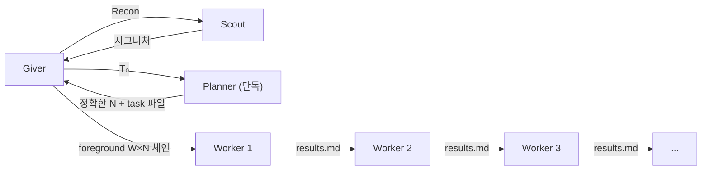

# Giver

v0.1.0

[](https://www.npmjs.com/package/@sng2c/pi-the-giver) [](https://opensource.org/licenses/MIT)

## 설치

```bash
pi install npm:@sng2c/pi-the-giver
```

[pi-subagents](https://www.npmjs.com/package/pi-subagents) `latest` 필요 (foreground W×N 체인, 구조적 `[Read from:]` reads 주입).

## 활성화

설치 후 Pi 세션에서 스킬을 활성화:

```
/skill:giver
```

또는 프로젝트 지시 파일(`.pi/AGENTS.md`)에 추가하여 코딩 작업 시 자동 활성화.

## 빠른 시작

활성화 후 Pi에 작업을 설명:

```
Use the giver skill to implement a user authentication module with login, signup, and password reset
```

Pi가 Planner → Workers 파이프라인을 오케스트레이션:
1. **Giver**가 Task #0 작성 (Goal, Background, Signatures, Target Files)
2. **Planner**(단독, fresh)가 Worker별 task 파일(task1.md … taskN.md) 작성 후 Plan 반환 — **정확한** 개수 N + 레이어 순서
3. **Giver**가 **정확히 N개 Worker**(W₁ … W_N)로 foreground 체인을 구성·실행
4. **Workers**가 격리된 fresh 컨텍스트에서 작업 구현; W_N 끝나면 체인 자연 종료 (빈 슬롯 없음, completionGuard 없음)
5. **Giver**가 results.md를 읽고 검증 후 보고

### 작동 원리

- Giver가 모든 대화 컨텍스트를 보유 — 코드를 직접 수정하지 **않음**
- Planner와 Worker는 **fresh** 컨텍스트에서 실행 (히스토리 누수 없음)
- Worker 간 통신은 **results.md**로 (`[Read from:]` 구조적 주입, 프롬프트 전달이 아님)
- 각 Worker는 **자기 스코프만 소유** — task 내 파일만 수정
- **모든 에이전트 fresh**(Planner·Scout·Worker — 누구도 Giver 컨텍스트 상속 안 함); builtin planner/worker의 `fork` 기본값을 매 호출마다 `fresh`로 덮음
- **정확한 N, completionGuard 없음**: Planner가 단독으로 돌아 체인 빌드 전에 N이 확정되므로, 체인은 정확히 N step — 빈 슬롯 없음, no-op Worker 없음, `[CHAIN COMPLETED]` 시그널 없음. W_N 끝나면 자연 종료.

### 주요 명령

| 명령 | 설명 |
|---|---|
| `/skill:giver` | Giver 스킬 활성화 |
| `Use the giver skill to [작업]` | Giver 파이프라인 시작 |
| `Use the giver skill with scout to investigate [버그]` | Scout 단독 진단 |

전체 설정과 템플릿은 [SKILL.md](skills/giver/SKILL.md) 참조.

---

> *"기억을 전달받는다면, 그건 온전한 기억이어야 한다."*
> — 로이스 로리, 《기억 전달자》
>
> 《기억 전달자》에서 한 사람이 세상의 모든 기억을 품는다. 나머지는 **Sameness** 속에 산다 — 역사도, 맥락도, 축적된 노이즈도 없이. 기억 전달자는 필요한 순간에 필요한 기억만 골라 전달한다. **고통의 전달**(giving of pain)을 통해 레거시의 고통스러운 진실 — 실패, 제약, 절대 피해야 할 것 — 을 정제하여 백지 상태의 수령자에게 주입한다.
>
> 우리의 Giver도 똑같이 작동한다:
>
> | 소설 | 아키텍처 |
> |---|---|
> | 기억 전달자가 모든 기억을 보유 | Giver가 모든 대화 컨텍스트를 보유 |
> | 수령자는 전달받은 것만 받음 | Planner는 Giver의 T₀만 수신 |
> | 공동체는 Sameness 속에 산다 | Worker/Scout는 완전히 fresh — 역사 0 |
> | 전달은 선택적이고 의도적 | Giver는 T₀에 명시적 6섹션만 전달 |
> | 기억은 전달자에만 머물고 아래로 새지 않음 | 대화 컨텍스트는 Giver에만, 하류로 격리 |
> | 고통의 전달 (giving of pain) | Giver가 실패 기억을 Past failures로 주입 |

## Giver란

사용자의 코딩 작업을 대화로 받아, 여러 에이전트에 작업을 나누어 위임하는 오케스트레이터다. 사용자는 Giver와 대화하고, Giver는 체인을 통해 Planner·Scout·Worker를 호출한다.

## 문제: 코딩 I/O의 누적

코딩 에이전트는 파일을 읽고, 코드를 작성하고, 테스트를 돌린다. 이 **코딩 I/O**(소스 파일, 테스트 출력, 에러 로그)가 스텝마다 누적되면 컨텍스트가 지수적으로 증가한다.

$$
|\text{context}(n)| = |\text{context}(1)| \cdot r^{n-1} \quad (r > 1)
$$

컨텍스트가 커지면 **스티어링**(방향 지시: "어떤 파일을 만들지, 어떤 에러를 고칠지")이 코딩 I/O 노이즈에 묻힌다. 결과적으로 에이전트가 엉뚱한 파일을 수정하거나 이미 고친 에러를 재시도하는 등 방향을 잃는다.

## 해법: 스티어링 격리 파이프라인

컨텍스트를 **스티어링**(방향 지시)과 **코딩 I/O**(실행 산출물)로 분해하고, 에이전트 경계에서 스티어링만 전달한다.


Giver는 단독 Planner의 Plan(정확한 N + 레이어 순서)으로 **정확히 N개 Worker의 foreground 체인**을 구성한다. 체인 빌드 전에 N이 확정되므로 **빈 슬롯이 없다** — no-op Worker 없음, `[CHAIN COMPLETED]` 시그널 없음, completionGuard 재용 없음. W_N 끝나면 자연 종료. 이건 v3.7.5의 고정 10슬롯 + completionGuard 우회를 뿌리에서 제거한다: 그 우회는 Planner가 **체인 안에** 있어 N을 실행 중에 결정할 수밖에 없어 10슬롯을 미리 깔고 남은 꼬리를 completionGuard로 끊어야 했기 때문. Planner를 단독으로 빼면 N이 사전에 확정돼 체인이 정확히 사이징되고 completionGuard는 발화할 일이 없다.

| 경계 | 전달 (스티어링) | 격리 (코딩 I/O) | 격리율 |
|------|--------------|---------------|--------|
| G → P | T₀ | Giver 대화 (~500K토큰) | **99%** |
| P → Wₖ | taskₖ.md | 다른 Worker 태스크 | **83~93%** |
| Wₖ → G | RESULT | Worker 실행 전체 | **98~99%** |

> 격리율 = 1 − (전달 크기 / 격리 전 컨텍스트 크기). 출처: c2e86d3b 체인 측정

## 설계 원칙

[GGON(꼰)](https://gist.github.com/sng2c/a6d201dff2d66b1a589658056e5861a9)을 기반으로 Giver에 맞게 번역했다.

Giver는 T₀를 쓰기 전에 이 원칙들을 적용한다. 작업의 범위, 분할, 위임을 결정한다.

1. **최소 침투**: 기존 구조 보존, 최소 변경으로 요구사항 충족. 핵심 로직 수정보다 새 인터페이스나 브릿지 패턴으로 확장.

2. **중앙 제어 존중**: Giver→Planner→Worker 파이프라인이 중앙 제어. Worker는 구현만, 아키텍처 결정은 Giver와 Planner.

3. **인지 부하 관리**: Human이 인계받을 수 있도록 변경을 명확한 단위로 분할. T₀와 Tₖ는 대화 기록 없이 자체 완결.

4. **관심사 격리**: Worker는 Tₖ 내 파일만 수정. Signatures 참조 파일은 읽기 허용, 수정은 금지.

5. **리팩터 가치 = 다음 변경 비용 감소**: 리팩터링은 자동이 아닌 설계 결정. Giver가 사용자에게 제안, 구체적 메커니즘으로 정당화, 승인 시만 T₀에 포함.

## 3-tier 구조

**Giver**(대화): 사용자 대화에서 결정을 추출하여 T₀를 작성. 코드를 직접 다루지 않음.

**Planner**(계획): T₀에서 Worker별 task{k}.md를 생성. T₀ Signatures가 충분하지 않으면 Target Files에서 구현 패턴을 추출.

**Worker**(실행): 자기 task{k}.md와 이전 Worker의 RESULT만 수신. 격리된 스코프에서 작업을 실행. 각 Worker는 fresh 컨텍스트로 실행되어 부모나 다른 Worker의 I/O에 영향을 받지 않음.

## 파이프라인

```
G → S(Recon) → G → T₀ → P → {T₁, T₂, T₃}
                                ↓
                           W₁(T₁) → R₁           ← task file only, NO Planner output
                           W₂(T₂, R₁) → R₂       ← prev Worker RESULT only
                           W₃(T₃, R₂) → R₃       ← 조합 전이
```

- **Scout**: Giver가 코드 구조를 직접 읽지 않고 Scout에게 위임. 체인 밖에서만 호출.
- **RESULT = Files + Signatures + Breaking + Summary**: 코드 본문은 포함하지 않아 {previous}를 통한 I/O 역류를 차단.
- **조합 전이**: Rₖ는 Rₖ₋₁의 결과를 반영하여 만들어지므로 정보가 조합적으로 하류에 전달됨. 하지만 각 RESULT는 스티어링만 포함하므로 |Rₖ|는 일정 범위에 바운드됨.

> Phase 정의, SCOPE 규칙, 템플릿, 실패 프로토콜은 [SKILL.md](.pi/agent/skills/giver/SKILL.md) 참조

## 성능

에이전트 1회 실행당 컨텍스트 크기가 구조 효율성의 핵심 지표다. 과제가 복잡하면 총 토큰도 커지는 건 당연하다. **in/turn**(Worker 턴당 처리 토큰)으로 비교한다.

### 모놀리식 → v3.6.3 진화

```
버전            W_tokens평균  W in/turn   핵심 변화
───────────────────────────────────────────────────────────
모놀리식(fresh)  152K/18턴      8K        실측: Redbis 44테스트
v1              1.9M            —        Giver 베이스라인, fork 누수
v2              1.4M            —        fork 제거
v2.5b           103K            —        Do-When, DI
v3.5             113K          44K        Planner 읽기 금지, W2 64턴
v3.6.1          841K           93K        reads:false (과다 읽기)
v3.6.2          228K           63K        auto-inject (과다 읽기 −32%)
v3.6.3           56K           12K        Target Verification (과다 검증 −81%)
v3.6.7            —           12K        W₁ {previous} 제거, R8 수정
v3.6.8            —           17K        brief/echo 충돌
v3.7.0            —           19K        results.md 도입
v3.7.3            —           19K        results.md + RESULT 양쪽 기록
v3.7.5            —           19K        [CHAIN COMPLETED] + completionGuard
v3.8.0            —           19K        foreground W×N(단독 Planner의 정확한 N), completionGuard 없음
```

**v3.6.3 in/turn(12K)은 모놀리식(8K)과 동급** — Worker당 효율성이 모놀리식과 비슷하면서 부분 재시도 가능.

### 동일 과제 비교 (Redbis 44테스트, 실측)

| 지표 | 모놀리식(fresh) | v3.6.1 | v3.6.2 | **v3.6.3** |
|------|:-----------:|:------:|:------:|:------:|
| 활성 Worker | 1 | 3 | 4 | 5 |
| W_tokens 합 | 152K | 344K | 1,141K | **282K** |
| W_tokens 평균 | 152K | 115K | 285K | **56K** |
| W in/turn | 8K | 93K | 63K | **12K** |
| P+W tokens | 152K | 378K | 1,266K | **421K** |
| 컨텍스트 | 누적 ❌ | fresh ✅ | fresh ✅ | **fresh ✅** |
| 부분 재시도 | 불가 ❌ | Worker 단위 ✅ | Worker 단위 ✅ | **Worker 단위 ✅** |

> 총 토큰은 모놀리식이 적지만, Worker당 효율과 재시도 가능성은 v3.6.3이 우위. [상세 분석](docs/performance-report.md)

## 참조

| 파일 | 내용 |
|------|------|
| [SKILL.md](.pi/agent/skills/giver/SKILL.md) | 전체 구현 (Phase, 템플릿, SCOPE, T₀/Tₖ, 실패 프로토콜) |
| [giver-principles.md](giver-principles.md) | 수학적 정의 (6원리, 집합, 함수, 불변량) |
| [insights.md](docs/insights.md) | 프로젝트 인사이트 (8개 핵심 통찰) |
| [performance-report.md](docs/performance-report.md) | 성능 분석 (v1~v3.7.3, in/turn, 동일과제 비교) |
| [chains.json](docs/chains.json) | 체인 분석 데이터 (28체인, 토큰+바이트) |
| [analysis-logic.md](docs/01-analysis-logic.md) | 분석 도구 로직 레퍼런스 |
| [history.md](docs/history.md) | v1~v3.8.0 개선 이력 |

## 버전 히스토리

| 버전 | 날짜 | 변경 |
|------|------|------|
| v3.0 | 2026-05 | 초기 파이프라인 아키텍처 |
| v3.2 | 2026-05 | 체인 내 Scout 제거, Planner가 Imports needed 큐레이팅 |
| v3.3 | 2026-05 | Planner가 task{k}.md 분리 작성 |
| v3.5 | 2026-05 | Planner "T₀에서만 큐레이팅", RESULT = Files/Signatures/Summary |
| v3.5.13 | 2026-05 | Signatures 통합, Breaking forward, T₀ Target Files, Planner Target Files 읽기 허용 |
| v3.6 | 2026-05 | 설계 원칙 (GGON), 리팩토링 설계 결정화, 모순 6건 수정 |
| v3.6.1 | 2026-05 | reads:false, no-op 강화, 모순 8건 수정 |
| v3.6.2 | 2026-05 | reads auto-inject, [Write to:] 경로 주입, 과다 읽기 −63% |
| v3.6.3 | 2026-05 | Target Verification scope, Planner가 검증 대상 지정 |
| v3.6.7 | 2026-05 | {previous} 체인 echo, Breaking 템플릿 버그픽스, 3회→1회 치환 수정 |
| v3.6.8 | 2026-05 | "brief" 제거로 echo/RESULT 충돌 해결, "Reproduce" 지시어 도입 (33588327 실측: echo 미준수, Breaking forward는 작동) |
| v3.7.0 | 2026-05 | results.md 구조적 통신, {previous} 제거, reads 자동 주입 (echo 미준수 → 구조적 해결) |
| v3.7.3 | 2026-05 | RESULT output + results.md 양쪽 기록 (67df5f65 실측: W1~W5 RESULT 포맷 + results.md 누적) |
| v3.7.5 | 2026-05 | [CHAIN COMPLETED] 시그널, completionGuard 체인 종료, NOOP Worker 절약 |
| v3.8.0 | 2026-07 | 단독 Planner의 **정확한 N**으로 foreground W×N 체인 — 고정 슬롯 없음, completionGuard 없음, `[CHAIN COMPLETED]` 없음. 구조적 `[Read from:]` reads 주입 + results.md 연속성 보존. Planner 단독으로 체인 빌드 전 N이 확정돼 빈 슬롯 원천 제거. `append-step`/async는 e2e 테스트 후 기각(자동 종료 경쟁; single 호출은 `reads` 무시). 모든 에이전트 fresh(planner/worker `fork` 기본값 덮음). |
| v0.1.0 | 2026-07 | **패키지 리네임** `@sng2c/giver-skill` → `@sng2c/pi-the-giver`; 패키지 버전 0.1.0으로 리셋(새 npm 이름). 아키텍처는 동일 = Pattern C(위 v3.8.0 설계). |